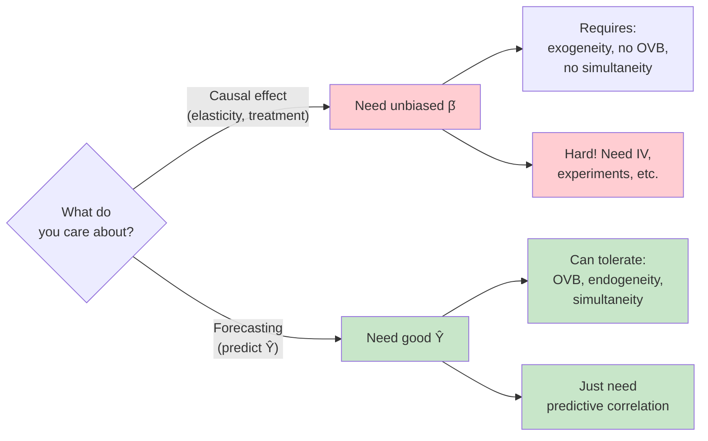
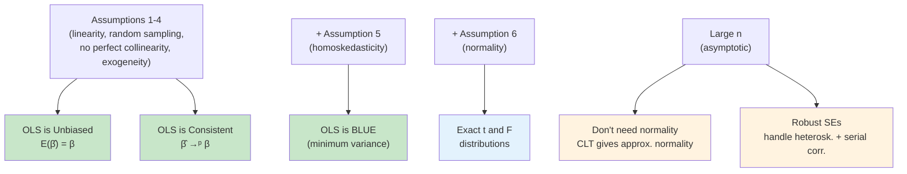
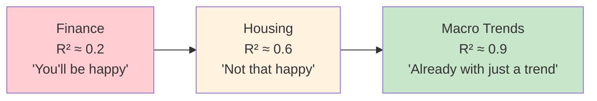
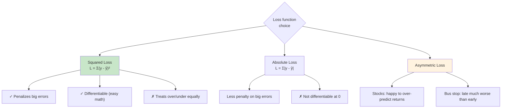
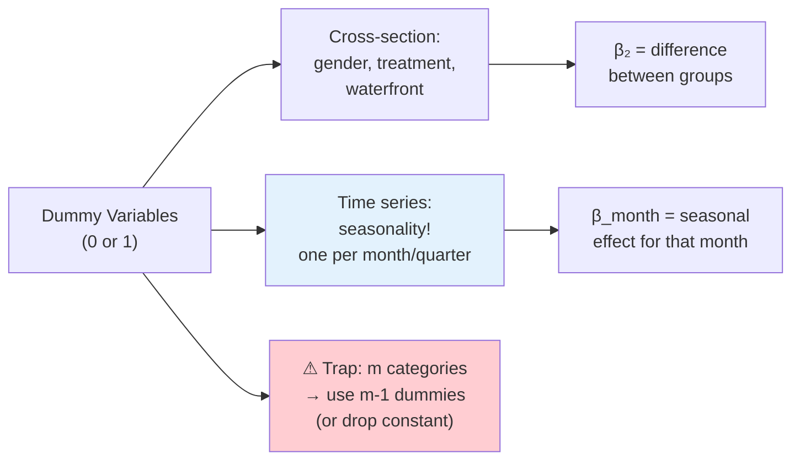

# Week 1: Key Concepts — Metrics Review

## Concept Map

```mermaid
graph TD
    A[Week 1: OLS Review] --> B[Estimation]
    A --> C[Assumptions]
    A --> D[Goodness of Fit]
    A --> E[Inference]
    A --> F[Dummy Variables]
    A --> G[Bridge to Time Series]

    B --> B1["Minimize Σû²"]
    B --> B2["β̂₁ = Cov(X,Y)/Var(X)"]
    B --> B3["Loss functions:<br/>squared vs absolute vs asymmetric"]

    C --> C1["Exogeneity: E(u|X) = 0"]
    C --> C2["Homoskedasticity: Var(u|X) = σ²"]
    C --> C3["No serial correlation"]
    C --> C4["i.i.d. sampling"]

    D --> D1["R² = 1 - RSS/TSS"]
    D --> D2["Adjusted R² penalizes<br/>extra variables"]
    D --> D3["R² benchmarks:<br/>macro ~0.9, housing ~0.6,<br/>finance ~0.2"]

    E --> E1["t = β̂/SE(β̂)"]
    E --> E2["F-test: joint significance"]
    E --> E3["Confidence intervals"]

    F --> F1["Group differences"]
    F --> F2["Interactions: different slopes"]
    F --> F3["Dummy variable trap"]

    G --> G1["AR(1) = OLS with Y_{t-1}"]
    G --> G2["Serial correlation → exploit it!"]
    G --> G3["Bias ≠ bad forecasts"]
```

## The Central Course Philosophy

**Pesavento:** "I'm going to repeat this a million times: I don't care about the parameter being unbiased, because I don't care about the causal relationship. I only care about forecasting."

## OLS Properties by Assumption

## Assumption Violations: What Matters for Forecasting?

| Violation | Bias? | SEs wrong? | Fix in cross-section | Fix in time series |
|-----------|-------|------------|---------------------|--------------------|
| Omitted variable | Yes | Yes | Add variable, IV | **Don't care** (for forecasting) |
| Simultaneity | Yes | Yes | IV, experiments | **Don't care** (for forecasting) |
| Heteroskedasticity | No | Yes | Robust SEs | Robust (HAC) SEs |
| Serial correlation | No | Yes (too small) | Cluster SEs | **Exploit it** with AR terms |
| Non-normality | No | Approx. wrong | Large n (CLT) | Large n (CLT) |

## R² Benchmarks by Field

**Pesavento:** "For finance, it's very hard to predict. On the other hand, when I run a trend on GDP data, the R-squared will be 90% already. Sometimes in macro we spend a lot of time going from 0.90 to 0.93, and that's going to buy us a lot."

## Loss Functions: Why Squared Isn't Always Right

## Dummy Variables: From Cross-Section to Seasonality

**Pesavento:** "For us, one of the biggest ways to use dummy variables is going to be for seasonality — one for each month, to indicate that some things happen that are specific to each month."

## Interaction Terms: Quick Reference

| Model | Non-waterfront (D=0) | Waterfront (D=1) |
|-------|---------------------|-------------------|
| No interaction | $\omega_0 + \omega_1 \text{SqFt}$ | $(\omega_0 + \omega_2) + \omega_1 \text{SqFt}$ |
| With interaction | $\omega_0 + \omega_1 \text{SqFt}$ | $(\omega_0 + \omega_2) + (\omega_1 + \omega_3) \text{SqFt}$ |

- Without interaction: same slope, different intercepts (parallel lines)
- With interaction: different slopes AND different intercepts
- $\omega_3$ = **incremental** effect of SqFt for waterfront, not the total effect

## The Big Ideas

### 1. OLS is the foundation for time series modeling
AR(1): $Y_t = \omega_0 + \omega_1 Y_{t-1} + u_t$ is just OLS regression where the regressor is the lagged dependent variable. Same estimation, same principle.

### 2. For forecasting, bias doesn't matter
This is Pesavento's central message: omitted variable bias, simultaneity, endogeneity — these ruin causal interpretation but NOT forecast quality. "I only care about predicting where it's going to go next."

### 3. Serial correlation is a feature, not a bug
In cross-section, serial correlation is a nuisance (wrong SEs). In time series, it's the entire point — we exploit temporal dependence to forecast. "Autoregressive models are all about exploiting serial correlation."

### 4. R² benchmarks are field-specific
Don't apply cross-section intuition to time series. $R^2 = 0.2$ in finance is great; $R^2 = 0.9$ in macro is just the starting point.

### 5. Parsimony matters, especially in macro
"Most times we're going to have 300–400 observations. We're going to want to be parsimonious." Adjusted R² enforces this by penalizing extra variables.

### 6. Look at coefficients relative to their standard errors
"I cannot look at this number in isolation. In isolation it means nothing." A coefficient only means something when paired with its standard error or confidence interval.

## Formulas to Know

1. **OLS slope:** $\hat{\omega}_1 = \text{Cov}(X,Y)/\text{Var}(X)$
2. **R²:** $R^2 = 1 - \text{RSS}/\text{TSS}$
3. **Adjusted R²:** $\bar{R}^2 = 1 - (1-R^2)\frac{n-1}{n-k-1}$
4. **t-statistic:** $t = \hat{\omega}_j / SE(\hat{\omega}_j)$
5. **95% CI:** $\hat{\omega}_j \pm 1.96 \times SE(\hat{\omega}_j)$
6. **F-statistic:** $F = \frac{R^2/k}{(1-R^2)/(n-k-1)}$
7. **OVB formula:** $\text{bias} = \omega_2 \cdot \text{Cov}(X_1, X_2)/\text{Var}(X_1)$
8. **Variance of $\hat{\omega}_1$:** $\text{Var}(\hat{\omega}_1) = \sigma^2 / \text{SST}_X$

## Common Exam Traps

- **Trap:** Thinking high R² means a good model. Could be spurious (two trending variables). "Churches vs bars — both driven by population."
- **Trap:** Thinking low R² means a bad model. In finance, $R^2 = 0.2$ with a significant coefficient is valuable.
- **Trap:** Looking at a coefficient without its standard error. "2.86 means nothing in isolation."
- **Trap:** Including all $m$ dummies plus a constant. That's perfect multicollinearity — always use $m-1$ dummies.
- **Trap:** Thinking OVB ruins everything. For forecasting, it doesn't matter — only for causal interpretation.
- **Trap:** Interpreting the interaction coefficient $\omega_3$ as the total effect for the treatment group. It's the **incremental** effect — the total effect for waterfront is $\omega_1 + \omega_3$.
- **Trap:** Assuming time series data is i.i.d. It's the first assumption to fail. "Is time series independent? No. There you go. First problem."
- **Trap:** Thinking serial correlation is just a nuisance. In time series, we exploit it for forecasting.
