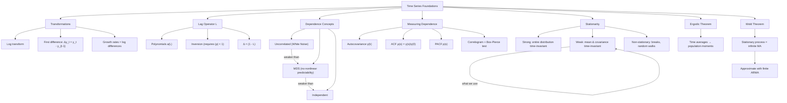
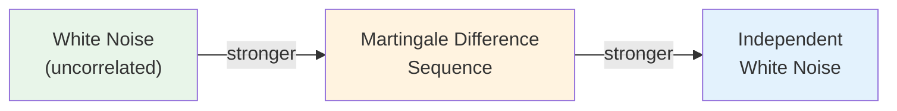
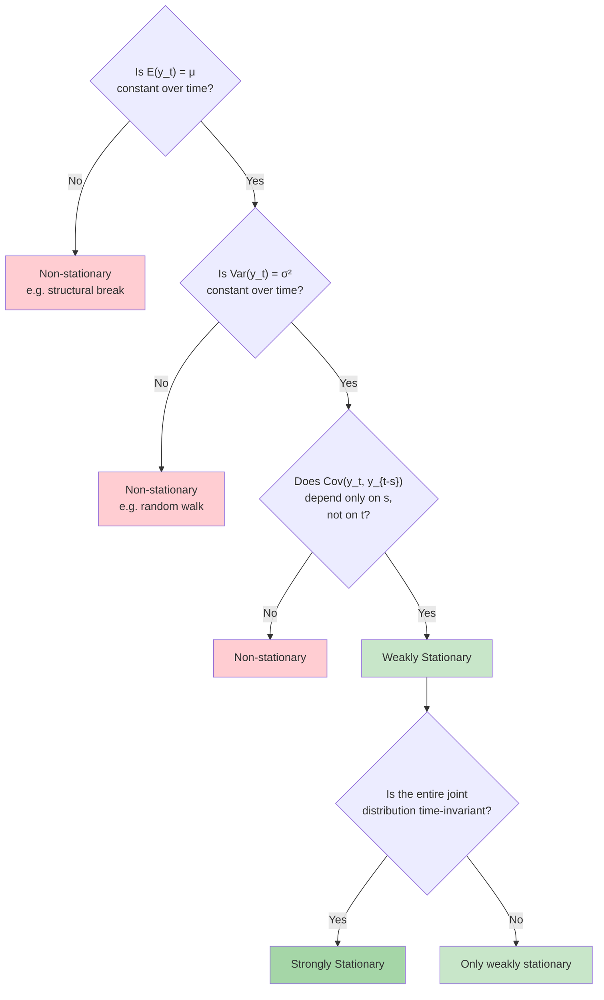
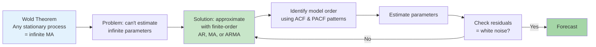

# Week 3: Key Concepts - Univariate Time Series Introduction

## Concept Map

## Dependence Hierarchy

| | White Noise | MDS | Independent |
|---|---|---|---|
| E(e_t) = 0 | Yes | Yes | Yes |
| E(e_t e_s) = 0 | Yes | Yes | Yes |
| E(e_t \| past) = 0 | Not required | **Yes** | Yes |
| E(e_t² \| past) = σ² | Not required | Not required | **Yes** |
| Correlation = 0 implies... | uncorrelated | unpredictable (in mean) | nothing to do with each other |

## Stationarity Decision Flow

## From Theory to Practice

## The Big Ideas

### 1. Dependence is what makes time series special
Cross-sectional data assumes independence between observations. Time series data has inherent temporal dependence. The entire course is about modeling this dependence structure.

### 2. Stationarity = stability over time
We need the data-generating process to be stable so that what we learn from the past applies to the future. Weak stationarity (constant mean, time-invariant covariance structure) is the practical requirement.

### 3. ACF and PACF are the primary diagnostic tools
- **ACF** shows total correlation at each lag
- **PACF** shows correlation at each lag after controlling for intermediate lags
- Together they identify which model fits the data (AR, MA, ARMA)
- This will be the main identification strategy going forward

### 4. White noise is the building block and the diagnostic target
- All models (AR, MA, ARMA) are functions of white noise
- If your model is correct, residuals should be white noise
- Best forecast of WN = 0 (its mean)

### 5. Correlation ≠ Independence
From class annotations: "Correlation only has to do with a linear relationship. This situation [corr=0 implies independence] is true only when we have normality." This is crucial for understanding the WN vs MDS vs independence hierarchy.

### 6. The Wold Theorem bridges theory and practice
Any stationary process has an infinite MA representation. We can't estimate infinite parameters, but we can approximate with finite-order ARMA models. This is the theoretical justification for everything that follows in the course.

## Formulas to Memorize

1. **Lag operator:** $Ly_t = y_{t-1}$, $(1-L)y_t = \Delta y_t$
2. **Lag polynomial inversion:** $(1-\rho L)^{-1} = \sum_{i=0}^{\infty} \rho^i L^i$ when $|\rho| < 1$
3. **ACF:** $\rho(s) = \gamma(s)/\gamma(0)$
4. **Sample ACF distribution:** $\hat{\rho}(s) \sim N(0, 1/T)$ under WN null
5. **Box-Pierce:** $Q_{BP} = T \sum_{s=1}^{m} \hat{\rho}^2(s) \sim \chi^2(m)$
6. **Wold:** $Y_t = \sum_{j=0}^{\infty} \psi_j \varepsilon_{t-j} + k_t$

## Common Exam Traps

- **Trap:** Assuming uncorrelated implies independent. It doesn't, unless Gaussian.
- **Trap:** Confusing ACF with PACF. ACF = simple correlation at lag s. PACF = partial correlation controlling for lags 1 through s-1.
- **Trap:** Forgetting that stationarity requires BOTH constant mean AND time-invariant covariance structure.
- **Trap:** Random walk has constant mean ($E[y_t] = E[\beta + e_t] = \beta$) but growing variance, so it's still non-stationary.
- **Trap:** The Wold theorem applies only to covariance-stationary processes.
