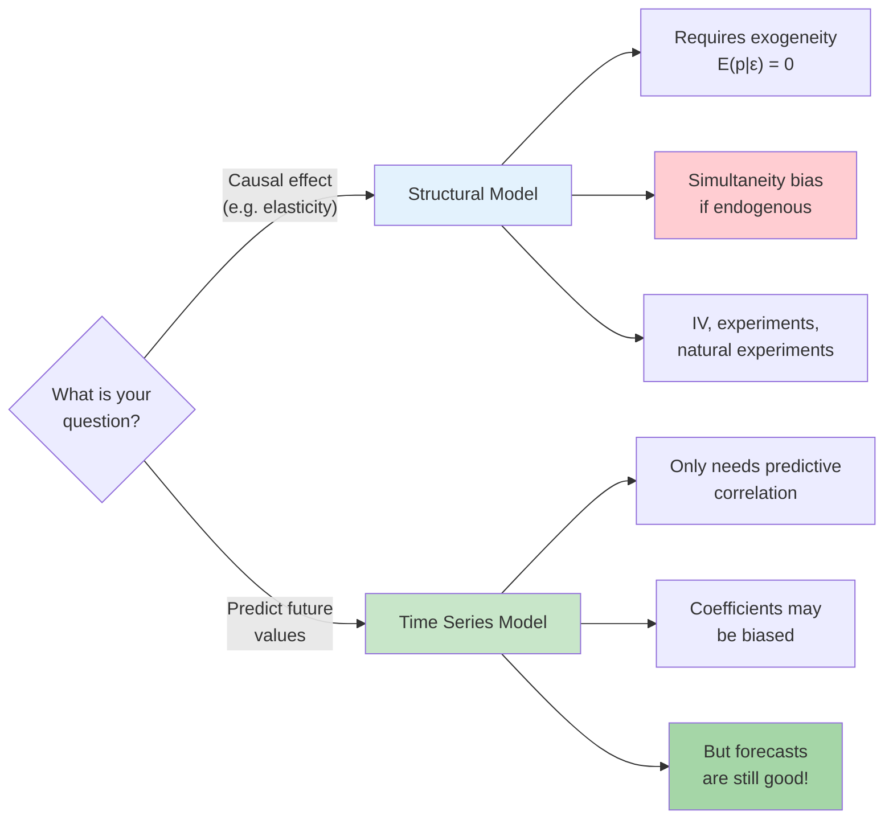
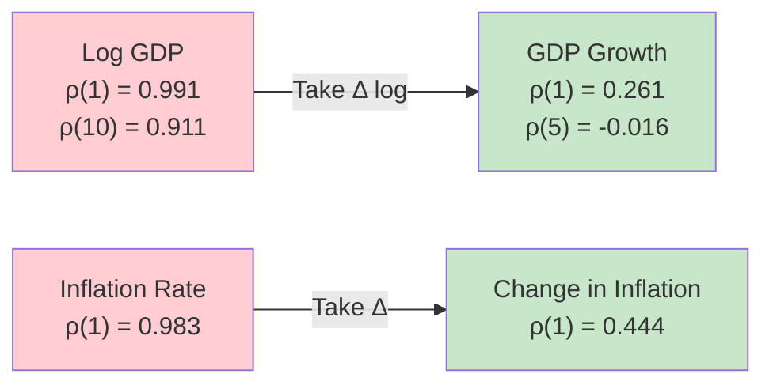
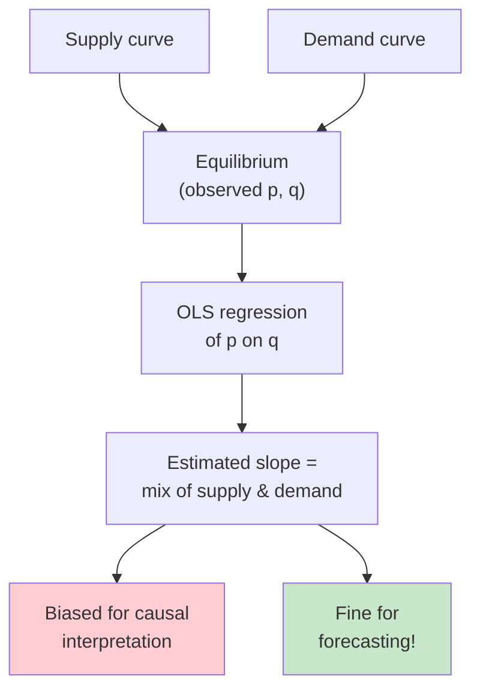
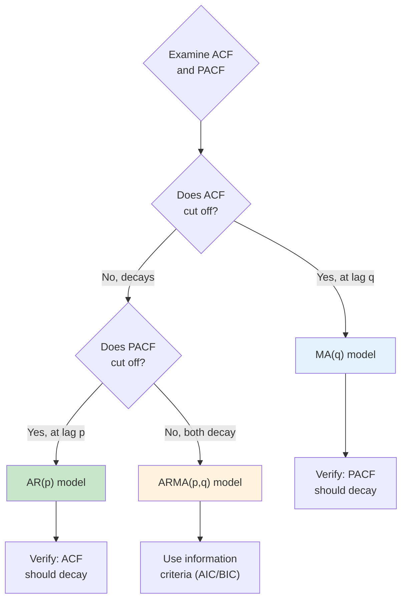
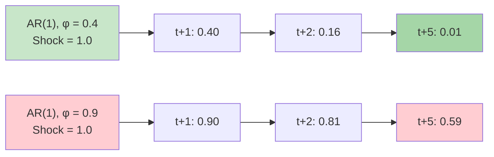
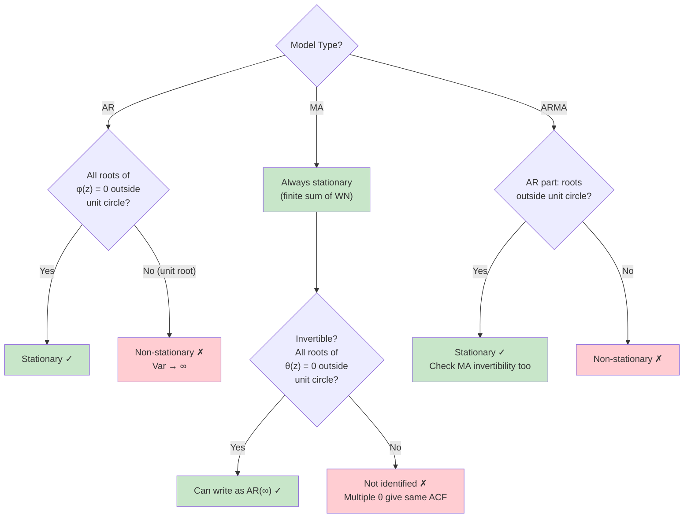
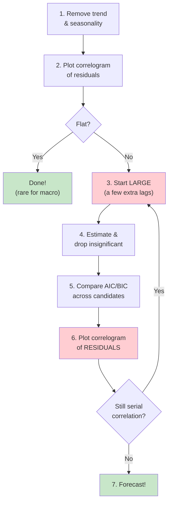
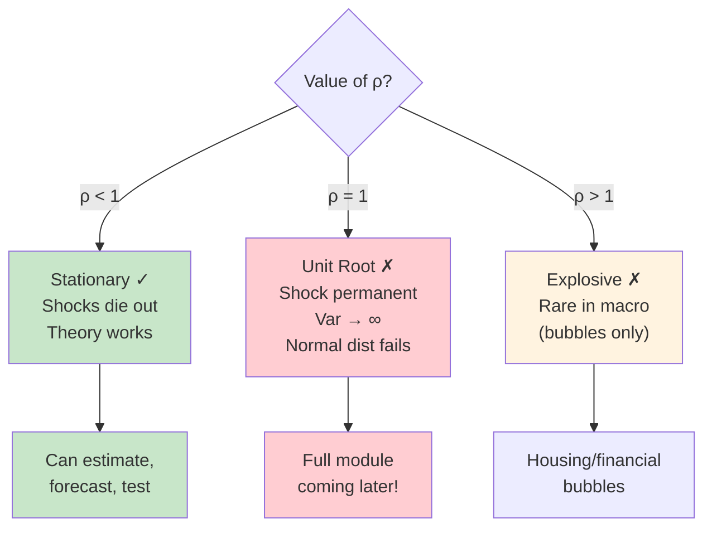

# Week 4: Key Concepts - Cycles Modeling & ARMA Models

## Concept Map

```mermaid
graph TD
    A[Week 4: Cycles, ARMA & Modeling Philosophy] --> B[Cycles]
    A --> C[Autocorrelation Evidence]
    A --> D[ARMA Models]
    A --> E[Stationarity & Invertibility]
    A --> F[Structural vs TS Models]
    A --> G[Identification & Estimation]

    B --> B1["Dynamics beyond trend & seasonality"]
    B --> B2["Shocks persist over time"]
    B --> B3["Booms follow booms, busts follow busts"]

    C --> C1["Inflation: ρ(1) = 0.98"]
    C --> C2["Log GDP: ρ(1) = 0.99"]
    C --> C3["GDP growth: ρ(1) = 0.26"]
    C --> C4["Differencing removes trend persistence"]

    D --> D1["AR(p): depends on past values"]
    D --> D2["MA(q): depends on past shocks"]
    D --> D3["ARMA(p,q): both combined"]

    E --> E1["AR: roots outside unit circle"]
    E --> E2["MA: always stationary"]
    E --> E3["Invertibility: |θ| < 1"]
    E --> E4["Unit root φ=1: non-stationary"]

    F --> F1["Structural: causality, needs exogeneity"]
    F --> F2["Time Series: forecasting, endogeneity OK"]
    F --> F3["Key insight: bias ≠ bad forecasts"]

    G --> G1["ACF/PACF patterns"]
    G --> G2["Box-Jenkins procedure"]
    G --> G3["Residual diagnostics"]
```

## The Central Distinction: Structural vs Time Series

## Effect of Differencing on Persistence

**Lesson:** Differencing removes trend-driven persistence. Remaining autocorrelation = cyclical dynamics worth modeling.

## Simultaneity Bias Intuition

## ACF/PACF Identification Guide

| Model | ACF | PACF | Memory |
|-------|-----|------|--------|
| AR(1) | Decays: $\rho^s$ | Cuts off after lag 1 | Infinite (geometric decay) |
| AR(2) | Decays/oscillates | Cuts off after lag 2 | Infinite |
| MA(1) | Cuts off after lag 1 | Decays | Finite (1 period) |
| MA(q) | Cuts off after lag q | Decays | Finite (q periods) |
| ARMA(p,q) | Decays | Decays | Infinite |

## AR(1) Persistence Comparison

**Lesson:** AR coefficient determines how long shocks persist. Higher $\phi$ = slower decay = longer forecasting horizon matters.

## Stationarity & Invertibility Conditions

## Pesavento's Practical Recipe (from lecture)

**Key emphasis:** "Start large, eliminate small" and "always plot residual correlogram" (red = what she repeats most)

## Unit Root: The Critical Boundary

**Pesavento:** "We're going to spend a whole module just on this. What happens when ρ = 1? The variance explodes. I cannot construct sensible forecasts. The usual distributions don't apply."

## The Big Ideas

### 1. Cycles = persistence of shocks
Economic shocks don't just hit and disappear — they propagate. This creates autocorrelation, which is what we model with AR/MA/ARMA.

### 2. Differencing removes trend persistence, not cycle persistence
Log GDP is 99% autocorrelated because of its trend. GDP growth (first difference) drops to 26% — but that remaining 26% is the cyclical component we want to model.

### 3. AR terms are the workhorse of forecasting (confirmed by all 3 real data examples)
From lecture: "Most things, almost everything, needs at least one lag. So at least AR(1), maybe sometimes more than one. Occasionally you will need a moving average in there, one, maybe." Unemployment → AR(3). GDP growth → AR(1). Inflation → AR(3-4).

### 4. Forecasting ≠ Causal inference
This is the philosophical foundation of the course:
- **Structural econometrics:** "What is the effect of X on Y?" → Needs exogeneity
- **Time series forecasting:** "What will Y be tomorrow?" → Needs correlation, not causation

### 5. $\rho$ is the dynamic multiplier / impulse response
From lecture: "If I have a shock today, how much of that shock will still be there tomorrow? $\rho$. Day after? $\rho^2$." This connects the math directly to economic meaning.

### 6. $\rho = 1$ is the most important boundary in time series
Pesavento: "We're going to spend a whole module just on this." When $\rho = 1$: variance → ∞, shock is permanent, normal distributions fail, forecasts break. Unit root testing is "very traditional — one of the first things you do."

### 7. AR and MA are mathematically interchangeable
From lecture: "Whether you go autoregressive or moving average, you and I may end up with something mathematically identical." AR(1) = MA(∞). MA(q) can be approximated by a finite AR. Don't agonize over which — use information criteria.

### 8. Watch for near-cancellation in ARMA
From GDP growth example: ARMA(1,1) with $\rho \approx 0.3$, $\theta \approx -0.3$ — both look insignificant together because they cancel! "It's almost like close multicollinearity." Always test each component individually.

### 9. Start large, go small (Pesavento's model selection philosophy)
"The ideal way to go is from large to small, rather than small to large." Start with more lags than you think you need, then eliminate. The residual correlogram is the ultimate diagnostic.

### 10. The residual correlogram is your best friend
From lecture: "The most important thing is: if you compute the autocorrelation function of the residuals, you should quickly be able to see whether you still have serial correlation." She checks this in every single real data example.

## Formulas to Know

1. **AR(1):** $y_t = c + \phi y_{t-1} + \varepsilon_t$
2. **AR(2):** $y_t = c + \phi_1 y_{t-1} + \phi_2 y_{t-2} + \varepsilon_t$
3. **MA(1):** $y_t = \mu + \varepsilon_t + \theta \varepsilon_{t-1}$
4. **MA(q):** $y_t = \mu + \varepsilon_t + \theta_1 \varepsilon_{t-1} + \ldots + \theta_q \varepsilon_{t-q}$
5. **ARMA(p,q):** $\phi(L) y_t = c + \theta(L) \varepsilon_t$
6. **AR(1) mean:** $E(Y_t) = c/(1-\rho)$
7. **AR(1) variance:** $\text{Var}(Y_t) = \sigma^2/(1-\rho^2)$
8. **AR(1) ACF:** $\rho(s) = \rho^s$
9. **MA(1) variance:** $\text{Var}(Y_t) = \sigma^2(1 + \theta^2)$
10. **MA(1) ACF:** $\rho(1) = \theta/(1+\theta^2)$, $\rho(k) = 0$ for $k \geq 2$
11. **AR to MA:** $(1-\rho L)^{-1} = \sum_{j=0}^{\infty} \rho^j L^j$ when $|\rho| < 1$
12. **Invertibility:** $(1+\theta L)^{-1}$ exists when $|\theta| < 1$
13. **Exogeneity condition:** $E[p|\varepsilon] = 0$ (required for causal interpretation only)

## Real Data Results Summary (from Feb 5 lecture)

| Series | Best Model | Key Coefficient | Notes |
|--------|-----------|-----------------|-------|
| Unemployment | AR(3) | $\hat{\rho}_1 = 0.95$ | Very persistent. AR(4) not significant. |
| GDP Growth | AR(1) | $\hat{\rho} \approx 0.3$ | ARMA(1,1) failed (near-cancellation). |
| Inflation | AR(3-4) | Persistent | Adding MA destabilized other coefficients. |

**Pesavento's lesson:** "The three real variables I had — they were basically all AR. That's probably reality."

## Common Exam Traps

- **Trap:** Thinking endogeneity ruins forecasts. It doesn't — it only ruins causal interpretation.
- **Trap:** Assuming high ACF means cycles. High ACF in levels could just be a trend (log GDP example). Check ACF of the differenced series.
- **Trap:** Thinking you always need AR(10) for persistent series. Usually AR(1) or AR(2) is sufficient.
- **Trap:** Confusing "we can't forecast structural breaks" with "we can't handle non-stationarity." We can detrend/difference to achieve stationarity, then forecast the stationary component.
- **Trap:** Saying MA processes can be non-stationary. MA(q) is **always** stationary — it's a finite sum of white noise terms.
- **Trap:** Confusing stationarity with invertibility. Stationarity is about the AR roots; invertibility is about the MA roots. Both require roots outside the unit circle, but for different polynomials.
- **Trap:** Thinking ACF = 0 after lag q means AR(q). No — ACF cutoff at lag q indicates MA(q). PACF cutoff at lag p indicates AR(p).
- **Trap:** Forgetting the unit root case. When $\phi = 1$ in AR(1), variance formula $\sigma^2/(1-\phi^2)$ explodes to infinity. The process is a random walk.
- **Trap:** Not checking invertibility for MA models. Two different $\theta$ values can produce the same ACF — always pick the invertible ($|\theta| < 1$) representation.
- **Trap (from lecture):** Eliminating both AR and MA terms simultaneously when they're individually significant. Near-cancellation makes both look insignificant together (GDP growth example). Always test each singularly.
- **Trap (from lecture):** Starting model selection from small to large. Pesavento explicitly says start large, go small — you might miss important lags if you start too small.
- **Trap (from lecture):** Not plotting the residual correlogram after estimation. "This is the most important thing" — if residuals still show serial correlation, you're not done.
- **Trap:** Thinking negative $\rho$ means ACF doesn't decay. It does — it just alternates sign: $\rho$, $\rho^2$ (positive), $\rho^3$ (negative), etc. "It's still going down, just flipping between positive and negative."
