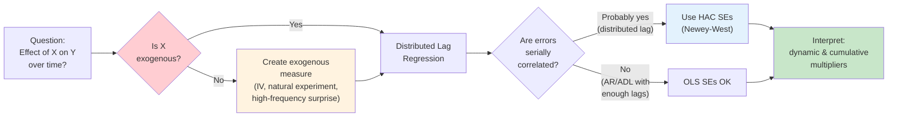
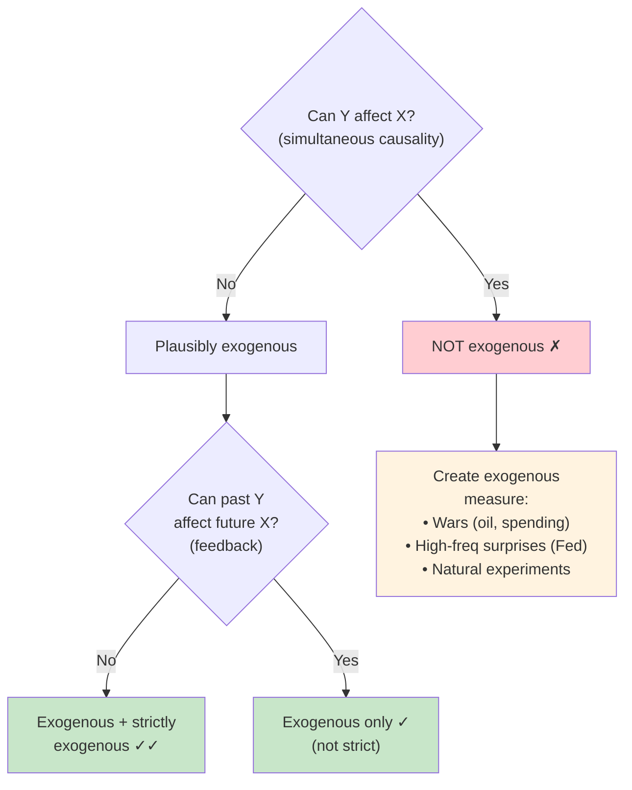
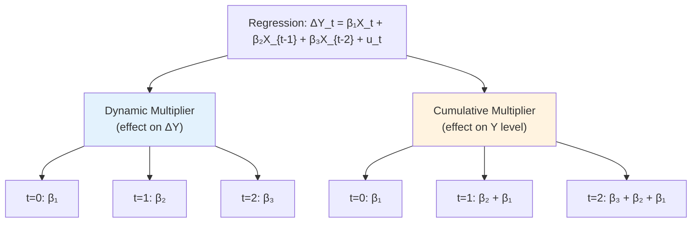
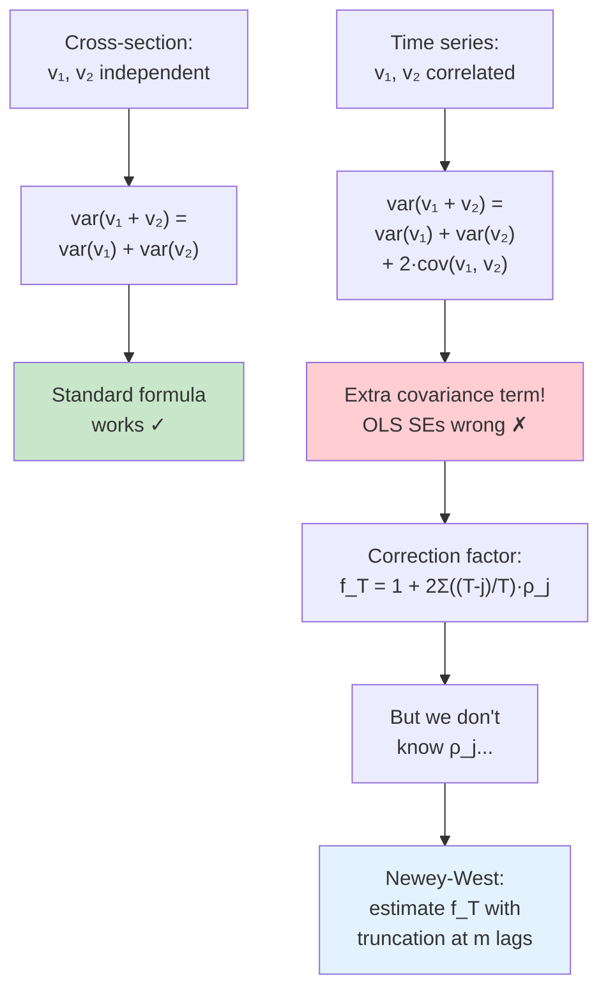
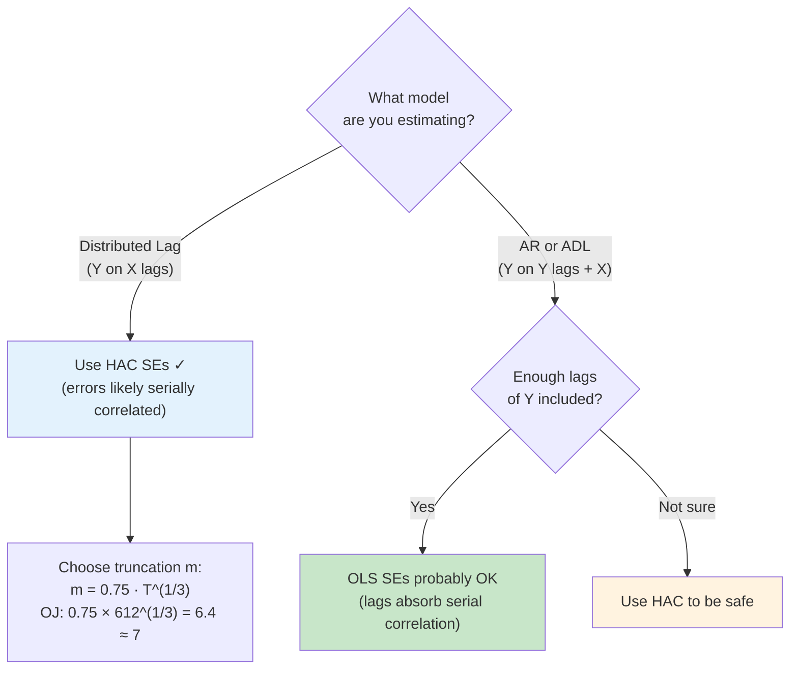

# Week 5: Key Concepts - Dynamic Causal Effects

## Concept Map

```mermaid
graph TD
    A[Week 5: Dynamic Causal Effects] --> B[Dynamic Causal Effects]
    A --> C[Distributed Lag Model]
    A --> D[Exogeneity]
    A --> E[HAC Standard Errors]
    A --> F[OJ Price Application]

    B --> B1["Effect of X on Y over time"]
    B --> B2["Ideal: RCT with repeated measures"]
    B --> B3["Feasible: same subject, different dates"]

    C --> C1["Y on X_t, X_{t-1}, ..., X_{t-r}"]
    C --> C2["Impact effect: β₁"]
    C --> C3["Dynamic multipliers: β₂, β₃, ..."]
    C --> C4["Cumulative multiplier: Σβ"]

    D --> D1["Exogeneity: E(u|X_t, X_{t-1},...) = 0"]
    D --> D2["Strict: also conditions on future X"]
    D --> D3["Simultaneous causality breaks it"]
    D --> D4["Feedback breaks strict version"]

    E --> E1["Serial correlation → wrong OLS SEs"]
    E --> E2["f_T correction factor"]
    E --> E3["Newey-West estimator"]
    E --> E4["Truncation parameter m"]

    F --> F1["FDD → OJ price changes"]
    F --> F2["Impact: 0.50%, fades by ~6 months"]
    F --> F3["Cumulative: peaks at 7 months"]
    F --> F4["Subsample instability"]
```

## The Core Pipeline: From Question to Causal Estimate

## Is X Exogenous? (Decision Tree)

**Exogeneity examples from class (Pesavento spent ~13 min on this — "super important"):**

| Example | Y | X | Exogenous? | Strictly Exog.? | Why? |
|---------|---|---|-----------|----------------|------|
| 1 | OJ prices | FDD (weather) | Yes | Borderline | Traders can't change weather |
| 2 | Australian exports | US GDP | Yes | Debatable | Australia too small to affect US |
| 3 | EU exports | US GDP | Questionable | No | EU large enough to affect US GDP |
| 4 | US inflation | OPEC oil prices | Plausible | No | OPEC sets prices independently |
| 5 | GDP growth | Fed Funds rate | **No** | No | Fed reacts to GDP (simultaneous) |
| 6 | Change in inflation | Unemployment | **No** | No | Phillips curve (simultaneous) |

## Dynamic vs Cumulative Multiplier (from your board note, page 31)

**Key insight from the recording:** "If your left-hand variable is the first difference, the coefficients give you the dynamic multiplier on the first difference. If you want the effect on the level, you need the cumulative multiplier." The professor derived this on the board — your page 31 board note has the full table showing $\Delta Y_t$ vs $Y_t = \Delta Y_t + Y_{t-1}$ at each lag.

**For the OJ data:**
- Dynamic multiplier = effect on price *changes* (%ChgP) → fades to insignificant by ~2 months
- Cumulative multiplier = effect on price *levels* → persists for about a year, peaks at 7 months

## Why OLS Standard Errors Fail (from your board note, page 19)

**From the recording (professor's board derivation, ~12 min):**
> "For two independent random variables, the variance of the sum is the sum of the variances. But if they're not independent, you have this extra piece."

The professor walked through the $T=2$ case on the board: $\text{var}(\frac{1}{2}(v_1 + v_2)) = \frac{1}{2}\sigma_v^2 \cdot f_2$ where $f_2 = (1 + \rho_1)$. When $\rho_1 = 0$ (cross-section), $f_2 = 1$ and the usual formula works. When $\rho_1 \neq 0$ (time series), the OLS SEs are off by $\sqrt{f_T}$.

## When Do You Need HAC?

**Pesavento's advice:** "The cost of using HAC is very little, and it protects you against serial correlation and heteroskedasticity. If you're absolutely sure your errors are not serially correlated, use normal standard errors. But you have to be pretty damn sure. If there's any doubt, use HAC."

## The Big Ideas

### 1. Dynamic causal effects unfold over time — the immediate impact is not the whole story
A freeze in Florida raises OJ prices by 0.50% immediately, but the cumulative effect peaks at ~0.90% after 7 months. In macro, the time dimension of effects is often more important than the point estimate.

### 2. The distributed lag model is the time series substitute for an RCT
Since we can't randomize treatments across subjects in macro (there's only one US OJ market), we treat the same subject at different dates as different "subjects." This requires **stationarity** (same distribution over time) and **exogeneity** (treatment is as-if random).

### 3. Exogeneity is the hardest assumption to satisfy — and the most important
Pesavento: "super important." The key question is always: can $Y$ affect $X$ back? Weather is plausibly exogenous for OJ prices (traders can't change the weather). The Fed Funds rate is NOT exogenous for GDP growth (the Fed explicitly reacts to economic conditions).

### 4. Creating exogenous measures is how modern macro identification works
> **From the recording:** "People spend a lot of time creating datasets that measure truly exogenous changes only."

The professor went beyond slides to explain:
- **Oil prices:** Isolate changes due to Middle East wars (truly exogenous geopolitical events)
- **Monetary policy:** Use high-frequency market data around Fed announcements to capture the "surprise" component
- **Government spending:** Exploit spending changes around wars
- This connects directly to VAR identification coming later in the course

### 5. Serial correlation breaks standard errors, not coefficient estimates
OLS coefficients are still consistent under serial correlation (given exogeneity). But the standard errors — and therefore all hypothesis tests and confidence intervals — are wrong. The $f_T$ correction factor can be large, meaning you could be wildly overconfident in your results.

### 6. HAC standard errors should be your default in distributed lag regressions
> "I would say, in my opinion, always use HAC regardless."

The Newey-West estimator replaces the unknown $f_T$ with $\hat{f}_T$ using estimated autocorrelations up to truncation $m$. For the OJ data: $m = 0.75 \times 612^{1/3} \approx 7$. The downside (small-sample imprecision in $\hat{f}_T$) is usually smaller than the risk of using wrong SEs.

### 7. Dynamic multiplier vs cumulative multiplier — know which one you're reading
Your board note (page 31) has the key table:
- **Dynamic multiplier** ($\beta_k$) = effect of shock on $\Delta Y_{t+k}$ (the *change*)
- **Cumulative multiplier** ($\sum_{j=1}^{k+1}\beta_j$) = effect on $Y_{t+k}$ (the *level*)

For OJ: the dynamic multiplier (effect on price changes) fades quickly, but the cumulative multiplier (effect on price levels) persists for about a year.

### 8. Subsample instability reveals violations of stationarity
The OJ freeze effect was much larger in 1950–1966 (peak ~2.0) than 1984–2000 (peak ~0.5, then negative). This means the distributed lag model assumptions (stationarity) may not hold across the full sample. Always check.

### 9. Strict exogeneity enables more efficient methods, but is rarely plausible
If $X$ is strictly exogenous ($E(u_t | \ldots, X_{t+1}, X_t, X_{t-1}, \ldots) = 0$), you can use GLS or ADL for more efficient estimation. But strict exogeneity requires no feedback at all — even future $X$ can't be correlated with current errors. This is almost never plausible in macro. Section 13.5 is optional.

### 10. This week bridges weeks 1–4 (forecasting) and the upcoming VAR module
> **Professor's preview:** "We will pick this up again when we think about VARs — the same autoregressive model but in vector form. And the exogeneity questions are going to become even more important."

Week 4's structural vs time series distinction is now concrete: the distributed lag model is a *structural* model (it claims causal effects), and its validity depends entirely on exogeneity. VARs will generalize this to multivariate settings.

## Formulas to Know

1. **Distributed lag model:** $Y_t = \beta_0 + \beta_1 X_t + \beta_2 X_{t-1} + \ldots + \beta_{r+1} X_{t-r} + u_t$
2. **Impact effect:** $\beta_1$
3. **$k$-period dynamic multiplier:** $\beta_{k+1}$
4. **$k$-period cumulative multiplier:** $\sum_{j=1}^{k+1} \beta_j$
5. **Exogeneity:** $E(u_t | X_t, X_{t-1}, X_{t-2}, \ldots) = 0$
6. **Strict exogeneity:** $E(u_t | \ldots, X_{t+1}, X_t, X_{t-1}, \ldots) = 0$
7. **Variance with serial correlation:** $\text{var}(\hat{\beta}_1) = \left[\frac{1}{T} \frac{\sigma_v^2}{(\sigma_X^2)^2}\right] \times f_T$
8. **Correction factor:** $f_T = 1 + 2\sum_{j=1}^{T-1}\left(\frac{T-j}{T}\right)\rho_j$
9. **Simple case ($T=2$):** $f_2 = 1 + \rho_1$
10. **Newey-West estimator:** $\hat{f}_T = 1 + 2\sum_{j=1}^{m-1}\left(\frac{m-j}{m}\right)\tilde{\rho}_j$
11. **Truncation parameter rule:** $m = 0.75 T^{1/3}$
12. **Percentage price change:** $\%ChgP_t = 100 \cdot \Delta\ln(\text{Price}_t)$
13. **Freezing degree days:** $FDD = \sum_{\text{days}} \max(32 - T_{\text{low}}, 0)$

## OJ Data Results (Table 13.1)

| Lag | Dynamic Multiplier | Cumulative Multiplier | Significant at 95%? |
|-----|-------------------|----------------------|---------------------|
| 0 | 0.50 (0.14) | 0.50 (0.14) | Yes |
| 1 | 0.17 (0.09) | 0.67 (0.14) | Borderline |
| 2 | 0.07 (0.06) | 0.74 (0.17) | No (dynamic) |
| 3 | 0.07 (0.04) | 0.81 (0.18) | No (dynamic) |
| 6 | 0.03 (0.05) | 0.90 (0.20) | No (dynamic) |
| 12 | -0.14 (0.08) | 0.54 (0.27) | No |
| 18 | 0.00 (0.02) | 0.37 (0.30) | No |

**Reading the multiplier graphic:** "If the confidence interval contains zero, that effect is not statistically different than zero. From about two months on, the effect on price changes is not statistically significant — but the effect on price levels persists for about a year."

**Note on confidence intervals:** In multivariate analysis, 68% confidence intervals are common because "there's so much uncertainty." At 95%, even the 1-month lag effect may not be significant.

## Common Exam Traps

- **Trap:** Confusing dynamic multiplier with cumulative multiplier. The dynamic multiplier ($\beta_k$) is the effect on $\Delta Y$ at lag $k$; the cumulative multiplier ($\sum \beta$) is the effect on $Y$ level. If your LHS is a first difference, coefficients give you the dynamic multiplier on the *change* — you need the cumulative sum for the effect on *levels*.

- **Trap:** Using standard OLS SEs for distributed lag regressions. Serial correlation in $u_t$ makes them wrong. You must use HAC (Newey-West) SEs. The distortion factor $f_T$ can be large.

- **Trap:** Thinking HAC SEs are always needed. For AR and ADL models with enough lags of $Y$, the errors are serially uncorrelated by construction — OLS SEs are fine. HAC is specifically needed for distributed lag models (where there are no lagged $Y$ terms to absorb serial correlation).

- **Trap:** Confusing exogeneity with strict exogeneity. Exogeneity conditions on past and present $X$ only. Strict exogeneity also conditions on *future* $X$. Strict implies regular, but not vice versa. FDD is plausibly exogenous but maybe not strictly (OJ price crash today could affect which groves are maintained, affecting future weather vulnerability).

- **Trap:** Assuming all macro variables are exogenous. The Fed Funds rate is NOT exogenous for GDP growth — the Fed explicitly reacts to economic conditions. Unemployment is NOT exogenous for inflation — Phillips curve creates simultaneous causality. Always think about feedback.

- **Trap:** Forgetting that $m$ (the truncation parameter) matters. For the OJ data, $m = 0.75 \times 612^{1/3} \approx 7$ (or 8). Too small → misses important autocorrelations. Too large → noisy estimate. The rule of thumb $m = 0.75 T^{1/3}$ is automated in Python/Stata but you should know the formula.

- **Trap:** Thinking the distributed lag estimator works without stationarity. The subsample instability in the OJ data (1950–1966 vs 1984–2000) shows the freeze-price relationship changed over time. If stationarity fails, coefficients are time-varying and the distributed lag estimates are unreliable.

- **Trap:** Ignoring the difference between "not significant" and "zero effect." From the OJ multiplier graphic, the dynamic multiplier at lag 2 is 0.07 — small but positive. The confidence interval includes zero, so we can't reject "no effect" statistically. That's not the same as saying the effect *is* zero.

- **Trap:** Thinking cross-section standard error formulas work in time series. The extra covariance term $2\text{cov}(v_1, v_2)$ is exactly what disappears under independence (cross-section) but doesn't disappear under serial correlation (time series). This is the whole reason HAC exists.

- **Trap (from midterm hints):** Expecting coding on the midterm. Pesavento: "I'll give you the output and ask you to interpret it." The midterm will have one theory question plus interpret-output problems. "Take the practice problems at heart."

## Midterm Preparation Notes (from Q&A at ~52:00)

- **Format:** Theory question(s) + interpret-output problems (professor provides graphs/tables, you interpret)
- **No coding** on the midterm — "I don't care that you find yourself here with 30 minutes pulling up AI"
- Coding is graded separately in the lab component
- **Practice problems** are from an older senior-level class — format may differ but content is the same
- Three problem sets before the midterm
- Best prep: follow along with slides, solve problem sets, then do practice problems
