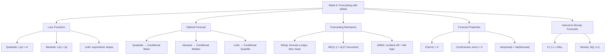
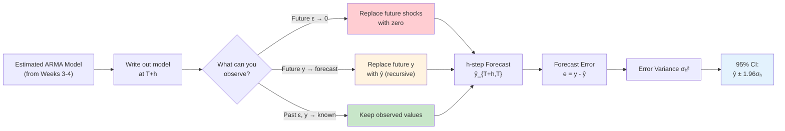
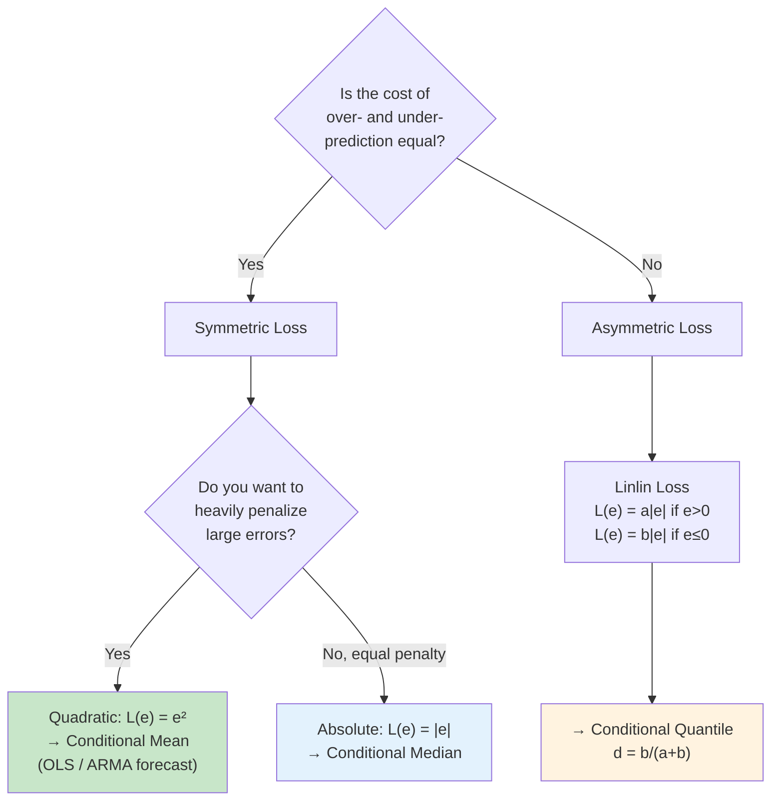
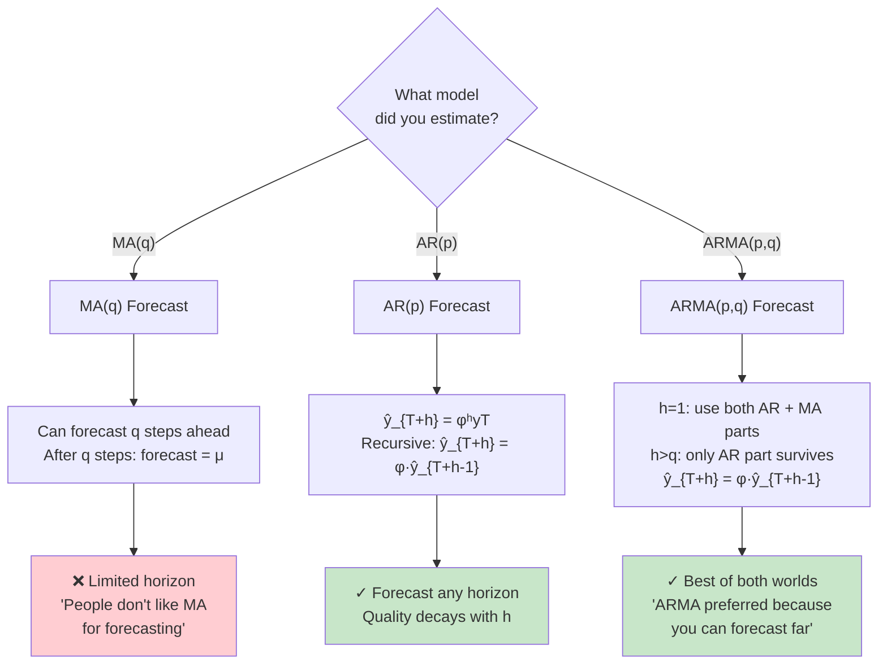
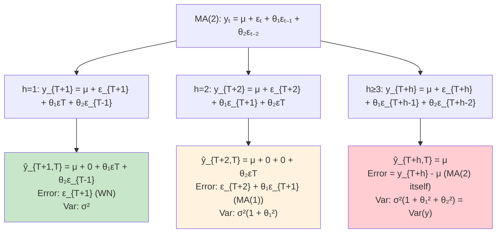
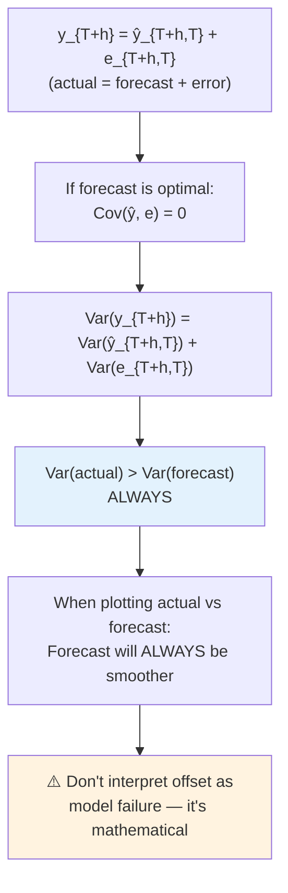
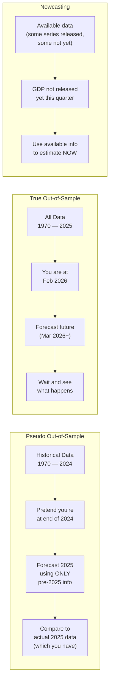

# Week 6: Key Concepts - Forecasting with ARMA Models

## Concept Map

## The Forecasting Pipeline

## Loss Function Decision Tree

**Pesavento's examples of asymmetric loss:**
- **Stock prediction:** Under-predicting a stock's rise → you miss investment gains (costly). Over-predicting → you invest more but it doesn't rise as much (less costly). → Penalize under-prediction more.
- **Bus arrival time:** Under-predicting arrival time → you miss the bus (costly). Over-predicting → you wait a bit longer (not costly). → Penalize under-prediction more.

## Which Model for Forecasting? MA vs AR vs ARMA

## MA(2) Forecast — Step by Step (from board notes)

**Rule:** Replace future $\varepsilon$ with 0 (can't forecast white noise). Keep past $\varepsilon$ (observed as residuals).

## The Variance Inequality (from board notes)

> **Professor:** "Don't expect your forecast to match the actual data identically. Your forecast will always be a bit smoother, with a smaller variance."

## Out-of-Sample vs Pseudo Out-of-Sample

> **Professor:** "Pseudo out-of-sample has to be done fair — no information past your cutoff date."

## The Big Ideas

### 1. The loss function determines what "optimal" means
Under quadratic loss, the optimal forecast is the conditional mean (what OLS gives you). Under absolute loss, it's the median. Under asymmetric loss, the optimal forecast is deliberately biased. **You must choose your loss function before you can say what the "best" forecast is.**

### 2. MA models have a hard forecast horizon limit
An MA($q$) can only forecast $q$ steps ahead. After that, the best forecast is the unconditional mean $\mu$. This is the practical reason ARMA and AR models dominate in applied forecasting.

### 3. AR models forecast recursively — quality decays but never hits a wall
For AR(1): $\hat{y}_{T+h,T} = \phi^h y_T$. Since $|\phi| < 1$ (stationarity), the forecast decays exponentially toward the mean. Unlike MA, there's no hard cutoff — just gradual loss of predictive power.

### 4. ARMA combines the best of both worlds
- At short horizons ($h \leq q$): the MA component adds forecasting power from recent shocks
- At longer horizons ($h > q$): the AR component keeps forecasting recursively
- This is why ARMA is the preferred specification for applied forecasting

### 5. Forecasts are always smoother than reality
$\text{Var}(y_{T+h}) = \text{Var}(\hat{y}_{T+h,T}) + \text{Var}(e_{T+h,T})$ — the forecast variance is strictly less than the data variance. When you plot forecast vs. actual, the forecast line will always be less volatile. **This is not a bug — it's a mathematical property of optimal forecasts.**

### 6. The forecasting workflow is: estimate → write model → think about what you know
> **Pesavento:** "Spend all the time you have to get the best model you can. Then write it down and think about what happens in the future."

The mechanical process: write out $y_{T+h}$ from the model, replace future $\varepsilon$ with 0, replace future $y$ with forecasts, keep everything observed.

### 7. Parameter estimation uncertainty is typically ignored in forecast intervals
The exact forecast error includes terms like $(\theta - \hat{\theta})\varepsilon_T$. In practice, we approximate by assuming estimated = true parameters. This underestimates the true forecast uncertainty slightly, but the approximation is standard.

### 8. Pseudo out-of-sample testing is how you validate before the future arrives
You pretend you're at time $T$, forecast $h$ steps ahead using only data through $T$, then compare to the actual realization (which you already have). **The key requirement is fairness — no peeking at future data.**

## Formulas to Know

1. **Forecast error:** $e_{T+h,T} = y_{T+h} - \hat{y}_{T+h,T}$
2. **Quadratic loss:** $L(e) = e^2$ → optimal = $E(y \mid \Omega_T)$
3. **Absolute loss:** $L(e) = |e|$ → optimal = median$(y \mid \Omega_T)$
4. **Linlin loss:** $L(e) = a|e|$ ($e>0$), $b|e|$ ($e \leq 0$) → quantile $d = b/(a+b)$
5. **MA($q$) forecast ($h \leq q$):** $\hat{y}_{T+h,T} = \theta_h \varepsilon_T + \theta_{h+1}\varepsilon_{T-1} + \ldots + \theta_q \varepsilon_{T-q+h}$
6. **MA($q$) forecast ($h > q$):** $\hat{y}_{T+h,T} = \mu$
7. **MA($q$) error variance ($h \leq q$):** $\sigma_h^2 = (1 + \theta_1^2 + \ldots + \theta_{h-1}^2)\sigma^2$
8. **AR(1) forecast:** $\hat{y}_{T+h,T} = \phi^h y_T$
9. **ARMA(1,1) 1-step:** $\hat{y}_{T+1,T} = \phi y_T + \theta \varepsilon_T$
10. **ARMA recursive ($h > q$):** $\hat{y}_{T+h,T} = \phi \hat{y}_{T+h-1,T}$
11. **Variance decomposition:** $\text{Var}(y_{T+h}) = \text{Var}(\hat{y}_{T+h,T}) + \text{Var}(e_{T+h,T})$
12. **95% interval:** $\hat{y}_{T+h,T} \pm 1.96\sigma_h$
13. **Density forecast:** $N(\hat{y}_{T+h,T}, \sigma_h^2)$
14. **Trend forecast:** $\hat{y}_{T+h,T} = \hat{\beta}_0 + \hat{\beta}_1(T+h)$
15. **ARMA(1,1) 2-step error variance:** $\sigma_2^2 = \sigma^2(1 + (\phi + \theta)^2)$

## Common Exam Traps

- **Trap:** Forgetting to replace future $\varepsilon$ with zero. Any white noise shock in the future CANNOT be forecast — your best guess is always zero (its mean).

- **Trap:** Thinking MA(2) can forecast 3+ steps ahead. After $q$ steps, the MA($q$) forecast is just $\mu$. The forecast error at $h > q$ is the process itself — you've lost all predictive power.

- **Trap:** Forgetting the recursive substitution for AR. For $h = 2$: $\hat{y}_{T+2,T} = \phi \hat{y}_{T+1,T}$ (NOT $\phi y_{T+1}$, because you don't observe $y_{T+1}$). You must substitute your forecast, not the unknown true value.

- **Trap:** Being alarmed that forecast doesn't match actual data. $\text{Var}(y) > \text{Var}(\hat{y})$ is a mathematical identity for optimal forecasts. The forecast will ALWAYS be smoother.

- **Trap:** Confusing out-of-sample with pseudo out-of-sample. True out-of-sample = forecasting into the unknown future. Pseudo = pretending you don't know data you already have, to test your model.

- **Trap:** Thinking optimal forecast is always unbiased. Under quadratic loss, yes — the conditional mean is unbiased. Under asymmetric loss, the optimal forecast is deliberately biased to avoid errors on the costlier side.

- **Trap:** Ignoring parameter estimation uncertainty. The forecast error $e_{T+2,T} = \varepsilon_{T+2} + \theta_1\varepsilon_{T+1} + (\theta_2 - \hat{\theta}_2)\varepsilon_T$. We approximate by dropping the last term, but this underestimates true forecast uncertainty.

- **Trap:** Not knowing the forecast error structure grows with horizon. At $h=1$: error is WN ($\sigma^2$). At $h=2$: error is MA(1) ($\sigma^2(1 + \theta_1^2)$). Variance grows with horizon until it reaches $\text{Var}(y_t)$.

## Connections to the Climate-Risk-Loans Project

This lecture is directly relevant to Phase 2 modeling:

1. **AR baseline models** (from empirical analysis notebook): We estimated AR(12) for BUSLOANS and AR(4) for CONSUMER — the recursive forecast formula $\hat{y}_{T+h,T} = \hat{\phi} \hat{y}_{T+h-1,T}$ is how we'll generate baseline loan growth forecasts.

2. **Loss function choice**: BofA cares about scenario ranges (best/worst case), not just point forecasts. This maps to interval/density forecasts, and potentially asymmetric loss if downside risk matters more.

3. **Pseudo out-of-sample validation**: The professor's framework for fair testing is exactly what we need — train on pre-2020 data, forecast 2020-2025, compare to actuals.

4. **Forecast variance inequality**: When we present forecast plots to BofA, the forecast will be smoother than actual loan data. We should explain this, not apologize for it.

5. **Thursday preview**: Forecast evaluation methods are coming — this will give us the tools (RMSE, Diebold-Mariano test) to compare our AR baseline against VAR/ADL models.
