# Week 6: Key Concepts - Forecasting with ARMA & Forecast Evaluation

## Full Week Concept Map

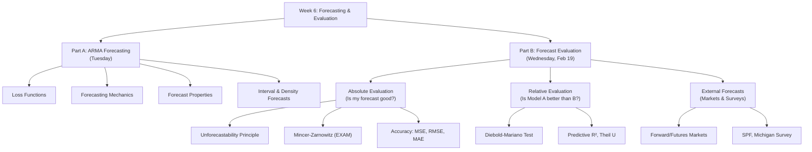

## The Forecasting Pipeline

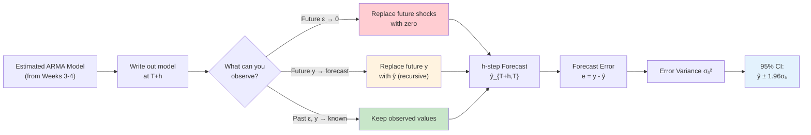

## Loss Function Decision Tree

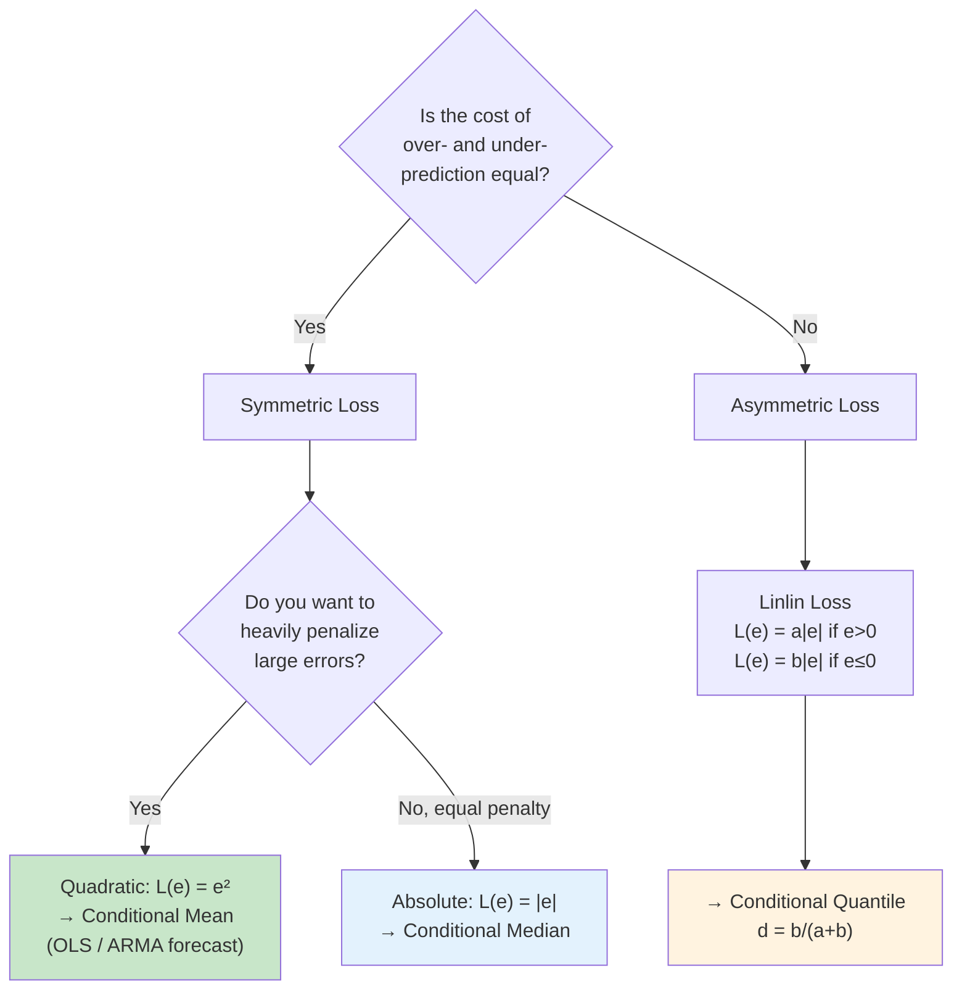

**Pesavento's examples of asymmetric loss:**
- **Stock prediction:** Under-predicting a stock's rise → you miss investment gains (costly). Over-predicting → you invest more but it doesn't rise as much (less costly). → Penalize under-prediction more.
- **Bus arrival time:** Under-predicting arrival time → you miss the bus (costly). Over-predicting → you wait a bit longer (not costly). → Penalize under-prediction more.

## Which Model for Forecasting? MA vs AR vs ARMA

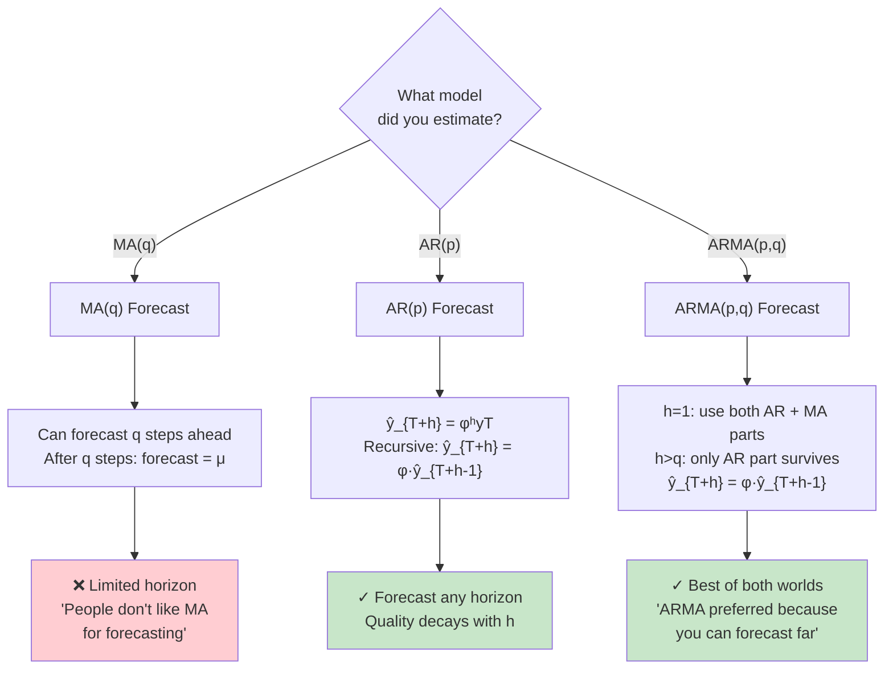

## MA(2) Forecast — Step by Step (from board notes)

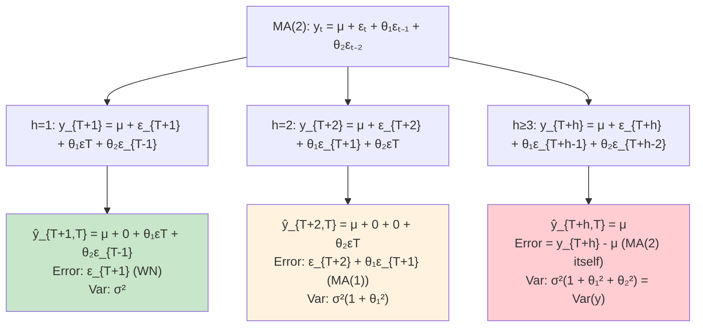

**Rule:** Replace future $\varepsilon$ with 0 (can't forecast white noise). Keep past $\varepsilon$ (observed as residuals).

## The Variance Inequality (from board notes)

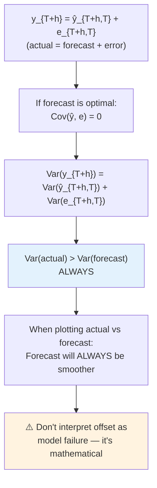

> **Professor:** "Don't expect your forecast to match the actual data identically. Your forecast will always be a bit smoother, with a smaller variance."

## Out-of-Sample vs Pseudo Out-of-Sample

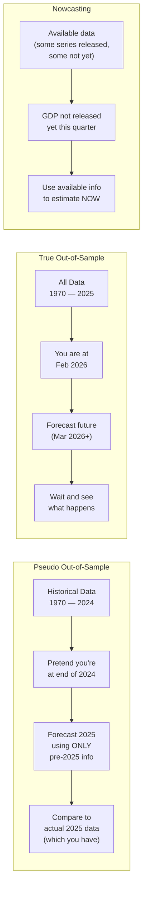

> **Professor:** "Pseudo out-of-sample has to be done fair — no information past your cutoff date."

## The Big Ideas

### Part A: Forecasting

### 1. The loss function determines what "optimal" means
Under quadratic loss, the optimal forecast is the conditional mean (what OLS gives you). Under absolute loss, it's the median. Under asymmetric loss, the optimal forecast is deliberately biased. **You must choose your loss function before you can say what the "best" forecast is.**

### 2. MA models have a hard forecast horizon limit
An MA($q$) can only forecast $q$ steps ahead. After that, the best forecast is the unconditional mean $\mu$. This is the practical reason ARMA and AR models dominate in applied forecasting.

### 3. AR models forecast recursively — quality decays but never hits a wall
For AR(1): $\hat{y}_{T+h,T} = \phi^h y_T$. Since $|\phi| < 1$ (stationarity), the forecast decays exponentially toward the mean. Unlike MA, there's no hard cutoff — just gradual loss of predictive power.

### 4. ARMA combines the best of both worlds
- At short horizons ($h \leq q$): the MA component adds forecasting power from recent shocks
- At longer horizons ($h > q$): the AR component keeps forecasting recursively
- This is why ARMA is the preferred specification for applied forecasting

### 5. Forecasts are always smoother than reality
$\text{Var}(y_{T+h}) = \text{Var}(\hat{y}_{T+h,T}) + \text{Var}(e_{T+h,T})$ — the forecast variance is strictly less than the data variance. When you plot forecast vs. actual, the forecast line will always be less volatile. **This is not a bug — it's a mathematical property of optimal forecasts.**

### 6. The forecasting workflow is: estimate → write model → think about what you know
> **Pesavento:** "Spend all the time you have to get the best model you can. Then write it down and think about what happens in the future."

The mechanical process: write out $y_{T+h}$ from the model, replace future $\varepsilon$ with 0, replace future $y$ with forecasts, keep everything observed.

### 7. Parameter estimation uncertainty is typically ignored in forecast intervals
The exact forecast error includes terms like $(\theta - \hat{\theta})\varepsilon_T$. In practice, we approximate by assuming estimated = true parameters. This underestimates the true forecast uncertainty slightly, but the approximation is standard.

### 8. Pseudo out-of-sample testing is how you validate before the future arrives
You pretend you're at time $T$, forecast $h$ steps ahead using only data through $T$, then compare to the actual realization (which you already have). **The key requirement is fairness — no peeking at future data.**

### Part B: Forecast Evaluation

### 9. You cannot just eyeball MSEs — you need the Diebold-Mariano test
Forecast errors are random variables, so the difference in MSEs between two models is also random. Just because Model A has a smaller MSE than Model B doesn't mean it's significantly better. The DM test formalizes this: it's a t-test for whether the mean loss differential is zero, using HAC standard errors. The Southern Company example proves the point: teams had different MSEs, but the DM test showed no significant difference.

### 10. The Mincer-Zarnowitz regression is the gold standard for testing forecast optimality
Regress $y_{t+h}$ on $\hat{y}_{t+h,t}$. If $(\beta_0, \beta_1) = (0, 1)$, your forecast is optimal (the actual differs from the forecast only by unpredictable noise). The professor marked this as EXAM material.

### 11. Bias is not always bad — the bias-variance trade-off
$MSE = \text{bias}^2 + \text{variance}$. A slightly biased model that dramatically reduces variance can have a lower MSE than an unbiased model. This is the forecasting analog of the regularization principle in statistics.

### 12. Markets aggregate forward-looking information
Financial market prices (forwards, futures, options) embed the collective expectations of participants who have real money on the line. Even without a causal story, these variables can be powerful predictors on the RHS of a forecasting model. The S&P 500 doesn't "cause" GDP growth, but it anticipates it.

### 13. Survey consensus forecasts are surprisingly good
Individual survey forecasts are noisy, but the average (consensus) of professional forecasters often beats sophisticated models. The SPF, Livingston Survey, and Michigan Survey are all practical data sources. The professor specifically suggested the Michigan inflation expectations survey for the consumer loans project.

## Formulas to Know

1. **Forecast error:** $e_{T+h,T} = y_{T+h} - \hat{y}_{T+h,T}$
2. **Quadratic loss:** $L(e) = e^2$ → optimal = $E(y \mid \Omega_T)$
3. **Absolute loss:** $L(e) = |e|$ → optimal = median$(y \mid \Omega_T)$
4. **Linlin loss:** $L(e) = a|e|$ ($e>0$), $b|e|$ ($e \leq 0$) → quantile $d = b/(a+b)$
5. **MA($q$) forecast ($h \leq q$):** $\hat{y}_{T+h,T} = \theta_h \varepsilon_T + \theta_{h+1}\varepsilon_{T-1} + \ldots + \theta_q \varepsilon_{T-q+h}$
6. **MA($q$) forecast ($h > q$):** $\hat{y}_{T+h,T} = \mu$
7. **MA($q$) error variance ($h \leq q$):** $\sigma_h^2 = (1 + \theta_1^2 + \ldots + \theta_{h-1}^2)\sigma^2$
8. **AR(1) forecast:** $\hat{y}_{T+h,T} = \phi^h y_T$
9. **ARMA(1,1) 1-step:** $\hat{y}_{T+1,T} = \phi y_T + \theta \varepsilon_T$
10. **ARMA recursive ($h > q$):** $\hat{y}_{T+h,T} = \phi \hat{y}_{T+h-1,T}$
11. **Variance decomposition:** $\text{Var}(y_{T+h}) = \text{Var}(\hat{y}_{T+h,T}) + \text{Var}(e_{T+h,T})$
12. **95% interval:** $\hat{y}_{T+h,T} \pm 1.96\sigma_h$
13. **Density forecast:** $N(\hat{y}_{T+h,T}, \sigma_h^2)$
14. **Trend forecast:** $\hat{y}_{T+h,T} = \hat{\beta}_0 + \hat{\beta}_1(T+h)$
15. **ARMA(1,1) 2-step error variance:** $\sigma_2^2 = \sigma^2(1 + (\phi + \theta)^2)$

### Part B Formulas (Forecast Evaluation)
16. **MSE:** $\widehat{MSE} = \frac{1}{T}\sum e^2_{t+h,t}$
17. **MSE decomposition:** $MSE = \sigma^2_e + \mu^2_e$ (variance + bias squared)
18. **RMSE:** $\widehat{RMSE} = \sqrt{\widehat{MSE}}$
19. **MAE:** $\widehat{MAE} = \frac{1}{T}\sum |e_{t+h,t}|$
20. **Predictive $R^2$:** $R^2 = 1 - \frac{\sum e^2_{t,t-1}}{\sum (y_t - \bar{y})^2}$
21. **Theil U:** $U = 1 - \frac{\sum e^2_{t,t-1}}{\sum (y_t - y_{t-1})^2}$
22. **Mincer-Zarnowitz (EXAM):** $y_{t+h} = \beta_0 + \beta_1 y_{t+h,t} + u_t$; optimality: $(\beta_0,\beta_1) = (0,1)$
23. **Orthogonality (EXAM):** $e_{t+h,t} = \alpha_0 + \alpha_1 y_{t+h,t} + u_t$; optimality: $(\alpha_0,\alpha_1) = (0,0)$
24. **DM test:** $DM_{12} = \bar{d}_{12} / \hat{\sigma}_{\bar{d}_{12}} \sim N(0,1)$; where $d_{12t} = L(e^a_t) - L(e^b_t)$
25. **Fisher equation:** $i_t(t+h) = r_t(t+h) + E_t(\pi_{t+h})$
26. **Forward rate (risk neutral):** $F_t(t+h) = E_t(S_{t+h})$

## Common Exam Traps

- **Trap:** Forgetting to replace future $\varepsilon$ with zero. Any white noise shock in the future CANNOT be forecast — your best guess is always zero (its mean).

- **Trap:** Thinking MA(2) can forecast 3+ steps ahead. After $q$ steps, the MA($q$) forecast is just $\mu$. The forecast error at $h > q$ is the process itself — you've lost all predictive power.

- **Trap:** Forgetting the recursive substitution for AR. For $h = 2$: $\hat{y}_{T+2,T} = \phi \hat{y}_{T+1,T}$ (NOT $\phi y_{T+1}$, because you don't observe $y_{T+1}$). You must substitute your forecast, not the unknown true value.

- **Trap:** Being alarmed that forecast doesn't match actual data. $\text{Var}(y) > \text{Var}(\hat{y})$ is a mathematical identity for optimal forecasts. The forecast will ALWAYS be smoother.

- **Trap:** Confusing out-of-sample with pseudo out-of-sample. True out-of-sample = forecasting into the unknown future. Pseudo = pretending you don't know data you already have, to test your model.

- **Trap:** Thinking optimal forecast is always unbiased. Under quadratic loss, yes — the conditional mean is unbiased. Under asymmetric loss, the optimal forecast is deliberately biased to avoid errors on the costlier side.

- **Trap:** Ignoring parameter estimation uncertainty. The forecast error $e_{T+2,T} = \varepsilon_{T+2} + \theta_1\varepsilon_{T+1} + (\theta_2 - \hat{\theta}_2)\varepsilon_T$. We approximate by dropping the last term, but this underestimates true forecast uncertainty.

- **Trap:** Not knowing the forecast error structure grows with horizon. At $h=1$: error is WN ($\sigma^2$). At $h=2$: error is MA(1) ($\sigma^2(1 + \theta_1^2)$). Variance grows with horizon until it reaches $\text{Var}(y_t)$.

### Part B Exam Traps (Forecast Evaluation)

- **Trap (EXAM):** Forgetting the Mincer-Zarnowitz regression. Regress $y_{t+h}$ on $\hat{y}_{t+h,t}$, test $(\beta_0, \beta_1) = (0, 1)$. The equivalent form: regress $e_{t+h,t}$ on $\hat{y}_{t+h,t}$, test $(\alpha_0, \alpha_1) = (0, 0)$. To go from one to the other, subtract $\hat{y}$ from both sides of the MZ regression.

- **Trap (EXAM):** Confusing orthogonality testing. The forecast error should be orthogonal to ALL available information, not just the forecast itself. The general test: $e = \alpha_0 + \sum \alpha_i x_i + u$, F-test that all $\alpha = 0$.

- **Trap:** Comparing MSEs without a formal test. Two models' MSEs will never be exactly equal (they're random variables). The Diebold-Mariano test is needed. Just because one MSE is numerically smaller does NOT mean the model is significantly better.

- **Trap:** Thinking bias is always bad. MSE = bias$^2$ + variance. A slightly biased model can have lower MSE than an unbiased one if the variance reduction is large enough.

- **Trap:** Using Theil's U and misinterpreting a value near zero. Many economic variables are near-random-walks, so beating the "no change" forecast (the benchmark for Theil's U) is very hard. A low U doesn't necessarily mean your model is bad.

- **Trap:** Forgetting HAC standard errors in the DM test. Multi-step-ahead forecast errors are serially correlated, so the loss differentials may also be serially correlated. The DM standard error must account for this (use HAC, or regress on intercept with AR(p) errors selected by AIC).

- **Trap:** Thinking market-based forecasts imply causation. The S&P 500 helps forecast GDP not because it causes growth, but because market participants anticipate future conditions. The predictive relationship runs through information aggregation, not causality.

## Part B: Forecast Evaluation (Feb 19 Lecture)

### 9. The Unforecastability Principle

> **Professor:** "If I can forecast in any way my forecast error, that means there was something in the model I have not exploited... my forecast in the first place was not optimal."

This is the **master property** of good forecasts. It holds regardless of:
- Whether you use linear projection or conditional mean optimality
- Whether the loss function is quadratic or not
- Whether the series is stationary or not

### 10. Checking Forecast Quality — The Mincer-Zarnowitz Regression (EXAM)

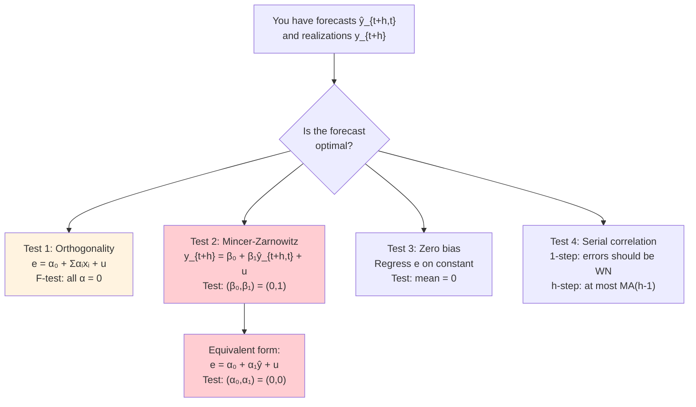

> **Professor:** "If you regress your forecast error on your forecast, these two coefficients should all be zero."

**Why the MZ regression works:** If $\beta_0 = 0$ and $\beta_1 = 1$, then $y_{t+h} = y_{t+h,t} + u_t$, which says the forecast differs from the actual only by an unpredictable error — exactly the optimality condition.

### 11. Accuracy Measures — The Hierarchy

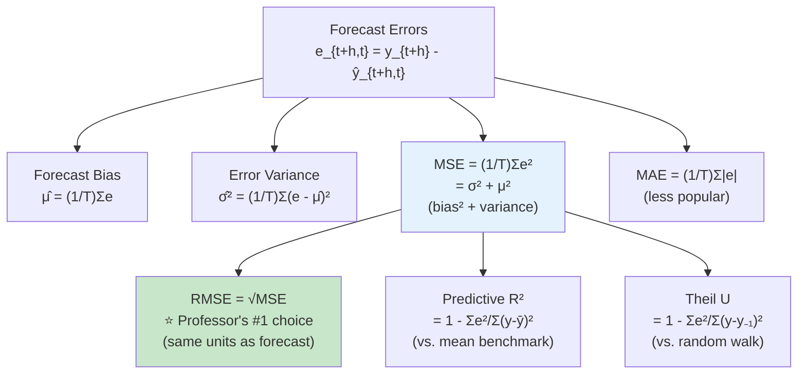

**The bias-variance trade-off:** $MSE = \sigma^2_e + \mu^2_e$

> **Professor:** "Sometimes you may be willing to take a little bit of bias if it gives you a much, much smaller variance."

This means: don't automatically reject a model just because it's slightly biased. If that bias buys you a big reduction in variance, the overall MSE can be lower.

### 12. Comparing Models — Diebold-Mariano Test

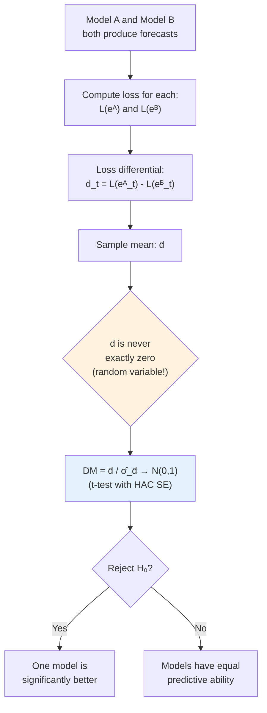

> **Professor (Southern Company example):** "From a pure pointwise view, one team did better, but when we tested the difference, there was no significant difference."

**Key insight the professor emphasized:** Forecast errors are random variables. Loss functions of random variables are random variables. So the difference in MSEs between two models is itself random. You MUST do a formal test — you cannot just eyeball which MSE is smaller.

**Simple implementation:** Regress the loss differential $d_t$ on a constant with HAC standard errors. The t-test on the intercept IS the DM test.

### 13. Market-Based and Survey-Based Forecasts

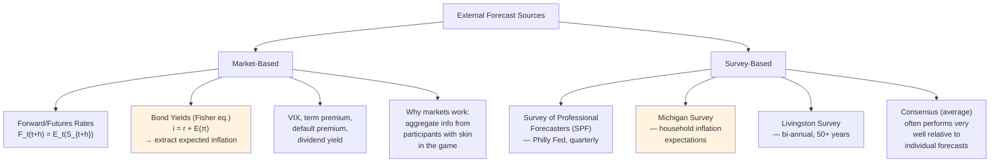

> **Professor on markets:** "It's not a causal relationship, but helpful in forecasting, because the market anticipates what's going to happen."

> **Professor on Michigan Survey (directly for BofA project):** "If you need to think about inflation for your consumer loans, there is data — University of Michigan — individual forecasts are all over the place, but on average, they do pretty well."

## Connections to the Climate-Risk-Loans Project

This week's material is directly relevant to Phase 2 modeling:

1. **AR baseline models** (from empirical analysis notebook): We estimated AR baselines for BUSLOANS and CONSUMER — the recursive forecast formula is how we generate baseline loan growth forecasts.

2. **Loss function choice**: BofA cares about scenario ranges (best/worst case), not just point forecasts. This maps to interval/density forecasts, and potentially asymmetric loss if downside risk matters more.

3. **Pseudo out-of-sample validation**: The professor's framework for fair testing is exactly what we implemented — expanding window, exclude COVID from evaluation.

4. **Forecast variance inequality**: When we present forecast plots to BofA, the forecast will be smoother than actual loan data. We should explain this, not apologize for it.

5. **MSE/RMSE** are exactly the metrics used in our OOS evaluation in `scenario_forecasting.ipynb` — the professor confirmed RMSE is the #1 choice.

6. **Diebold-Mariano test**: We should add this to formally compare AR baseline vs. VAR — just comparing RMSE numbers isn't enough (as the professor demonstrated with the Southern Company example). Our current 10-17% improvement could be statistically significant or not — the DM test would tell us.

7. **Mincer-Zarnowitz regression**: We should run this on our pseudo-OOS forecast errors to verify forecast optimality before presenting to BofA.

8. **Market variables as predictors**: The professor explicitly said putting financial variables like the S&P 500 on the RHS helps forecasting — this supports our use of DGS10 and FEDFUNDS as predictors in the consumer VAR. It's not a causal story; it's information aggregation.

9. **Survey inflation expectations**: For the consumer loan model, the Michigan Survey inflation expectations could be a useful additional predictor — the professor mentioned this specifically in the context of consumer loans.
