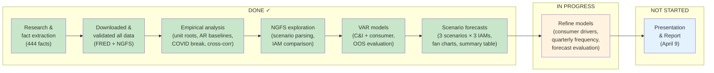

# Climate Risk & Loan Portfolios — Project Status

**Team:** Too Big to Melt
**Last updated:** Feb 24, 2026
**Phase:** 2 of 3 (Modeling & Iteration)

---

## Where We Are

**Key dates:**
- **Feb 12:** Kickoff with BofA (done)
- **Feb 20:** First Q&A session (done — all major questions answered)
- **~March 3:** Optional Q&A #2 (before spring break / midterm)
- **March 5:** Midterm
- **March 10-12:** Spring break
- **April 9:** Final 30-min presentation at Emory

---

## What's Been Built

### Three Notebooks (End-to-End Pipeline)

| Notebook | What It Does | Key Outputs |
|----------|-------------|-------------|
| `empirical_analysis.ipynb` | Historical loan + macro data analysis | Unit root tests, AR baselines, COVID break quantification, cross-correlations. 7 figures. |
| `ngfs_exploration.ipynb` | Climate scenario data exploration | Scenario path reconstruction, IAM model comparison, risk decomposition. 6 figures. |
| `scenario_forecasting.ipynb` | VAR estimation + scenario forecasting | Two VAR(1) models, pseudo-OOS evaluation, 25-year conditional forecasts, fan charts, summary table. 8 figures. |

Each notebook reads raw data independently — no hidden dependencies between them. Verified by data integrity audit.

### Research Foundation
- **444 facts** across 10 source files (Fed staff reports, BofA kickoff + Q&A, academic papers, NGFS docs, course materials)
- 5 of 8 research questions fully answered; 3 partially answered (awaiting final model results)
- 3 analysis runs (comprehensive v1, v2, gap analysis)

### Documentation (for teammates who don't read code)
- `docs/notebook-walkthrough.md` — 32 KB walkthrough of all 3 notebooks: purpose, step-by-step logic, data flow, key decisions
- `docs/data-integrity-audit.md` — Verified every data handoff. Result: zero red flags.
- `outputs/figures/` — 21 presentation-quality figures (300 DPI)
- `outputs/tables/scenario_summary.csv` — Master results table (18 rows, zero NaN)

---

## Current Model Results

### The Models

**C&I Loan VAR** — 4 endogenous variables: loan growth, unemployment change, Fed Funds change, CPI growth
- Unemployment is the dominant driver (coefficient: -5.82, p < 0.001). A 1pp rise in unemployment cuts C&I loan growth by ~6pp next year.
- Granger causality confirms: unemployment (p = 0.0004) and Fed Funds (p = 0.019) predict C&I loans. Inflation does not.

**Consumer Loan VAR** — 5 endogenous variables: adds DGS10 (10-year yield) because consumer loans (mortgages, auto) price off long-term rates
- Long-term rates are the dominant driver. DGS10 Granger-causes consumer loan growth (p = 0.023). Unemployment does NOT (p = 0.81).
- This makes economic sense: consumer borrowing depends on financing cost; C&I borrowing depends on business conditions.

Both models are VAR(1), estimated on 35 annual observations (1990-2025, ex-COVID). COVID handled via dummy variable per BofA instruction.

### VAR Beats Baseline

| Loan Type | AR(4) RMSE | VAR(1) RMSE | Improvement |
|-----------|-----------|-------------|-------------|
| C&I       | 10.09%    | 9.05%       | **10.4%**   |
| Consumer  | 16.85%    | 14.03%      | **16.7%**   |

Adding macro variables helps — especially for consumer loans.

### Scenario Forecasts (Median Across 3 IAMs)

| Loan Type | Scenario | 2030 Growth | 2050 Growth | 2050 Balance Index (2025=100) |
|-----------|----------|-------------|-------------|-------------------------------|
| C&I | Net Zero | +3.64% | +3.60% | **243** |
| C&I | Delayed Transition | +3.19% | +3.50% | 226 |
| C&I | NDCs | +3.19% | +3.40% | 229 |
| Consumer | Net Zero | +5.03% | +5.42% | 351 |
| Consumer | Delayed Transition | +5.32% | +5.58% | **410** |
| Consumer | NDCs | +5.32% | +5.59% | 385 |

### The Headline Finding

**C&I and consumer loans respond in opposite directions to climate policy:**
- **C&I loans do best under Net Zero** — early action keeps unemployment low, which drives business lending.
- **Consumer loans do best under Delayed Transition** — long-term rates stay lower when policy is delayed, which supports consumer borrowing.

This is the most interesting and presentable result. It creates tension: the "best" scenario depends on which part of the loan book you're looking at.

---

## What BofA Told Us (Feb 20 Q&A)

All major design questions resolved:

| Decision | BofA Answer |
|----------|------------|
| COVID treatment | Dummy variables. Exclude COVID from OOS evaluation. |
| Training window | At least 3 decades (1990s+). Cover enough business cycles. |
| Frequency | Try multiple, pick what works. Professor will teach MIDAS. |
| Consumer drivers | Indirect macro channel approved. **But: add more drivers** (house prices, sentiment, income). |
| Granularity | Stay aggregate US. No firm-level. |
| Scenarios | "Any or all." Open-ended. |
| Confidence intervals | They explicitly want to see bands. |
| Narrative | Show you understand the *stories*, not just the numbers. |
| Insights | Go beyond point estimates. Answer policy and systemic risk questions. |

---

## What Still Needs Work

### P1 — Must Do Before March 3

1. **Expand consumer loan drivers**
   - BofA pushed for house prices, disposable income, consumer sentiment
   - Candidates: CSUSHPINSA (Case-Shiller HPI), UMCSENT (Michigan sentiment), DSPIC96 (real disposable income)
   - Test in the consumer VAR, compare Granger causality and OOS performance

2. **Quarterly frequency comparison**
   - Current models are annual (36 obs). BofA said try multiple frequencies.
   - Quarterly gives ~140 obs — more degrees of freedom, more reliable coefficients
   - Need to decide how to handle NGFS (annual) → quarterly mapping
   - Professor teaching MIDAS soon — could be the answer

3. **Leading/lagging indicator audit**
   - BofA warning: "I've seen models that are too good because they accidentally used tomorrow's data"
   - Must document for each variable: release lag, reference period, lead/lag classification

4. **Formal forecast evaluation**
   - Apply Mincer-Zarnowitz regression (is the forecast unbiased?)
   - Apply Diebold-Mariano test (is VAR statistically better than AR?)
   - Both are Week 6 course material

### P2 — Before Presentation (April 9)

5. **Scenario narrative visualization** — Multi-panel figure that walks through each scenario's economic story with annotations
6. **Actionable insights framework** — 3-5 executive-level takeaways framed for a BofA audience
7. **Presentation structure** — Lead with headline finding (opposite directions), not methodology
8. **5-page technical report** — Concise methodology, feature selection reasoning, limitations

---

## Files & Where to Find Things

### For the Presentation Lead
- `outputs/figures/` — All 21 figures, print-ready
- `docs/notebook-walkthrough.md` — Plain English explanation of everything
- `outputs/tables/scenario_summary.csv` — Master results table

### For the Report Writer
- `docs/notebook-walkthrough.md` — Methodology walkthrough
- `analysis/runs/` — 3 analysis reports
- `artifacts/reports/2026-02-12-summary-report.md` — Research summary

### For the Economic Narrative Person
- `facts/by-source/` — 444 attributed facts from all sources
- `facts/by-source/feb20-qa-session.md` — Everything BofA told us
- `analysis/runs/2026-02-20-gap-analysis.md` — What's still missing

### For Gabriela (Technical)
- All 3 notebooks in `projects/climate-risk-loans/`
- `data/raw/` — 7 FRED CSVs + 2 NGFS Excel files
- `CLAUDE.md` — Full project context and modeling decisions

---

## The Story We'll Tell

> **Climate policy creates a tension in the loan book: what's good for business lending is bad for consumer lending, and vice versa.**

Supporting points:
1. **Acting early (Net Zero) benefits C&I loans** — gradual transition keeps unemployment low, businesses keep borrowing. By 2050, C&I balances are 7% higher than under Delayed Transition.
2. **Delaying action benefits consumer loans** — lower long-term rates support mortgage and auto borrowing. Consumer balances are 17% higher under Delayed Transition vs. Net Zero.
3. **The drivers are different** — unemployment drives C&I (Granger p = 0.0004); long-term rates drive consumer (Granger p = 0.023). Separate models are essential.
4. **COVID proved that sudden shocks hit loan portfolios hard and asymmetrically** — a disorderly climate transition would be a slower but sustained version of this.
5. **Model uncertainty is real** — 3 IAM families give a ~3% spread for the same scenario. Honest about what we don't know.
6. **For an executive:** the strategic question isn't "will loans go up or down" — it's "which part of the book is exposed to which scenario, and what's the portfolio-level net effect?"
