# Climate Risk & Loan Portfolios — Project Status

**Team:** Too Big to Melt
**Last updated:** Feb 25, 2026
**Phase:** 2 of 3 (Modeling & Iteration)

---

## Where We Are

```mermaid
flowchart LR
    subgraph "DONE ✓"
        A["Research &<br/>fact extraction<br/>(604 facts)"]
        B["Downloaded &<br/>validated all data<br/>(10 FRED + 2 NGFS)"]
        C["Empirical analysis<br/>(unit roots, AR baselines,<br/>COVID break, cross-corr)"]
        D["NGFS exploration<br/>(scenario parsing,<br/>IAM comparison)"]
        E["VAR models<br/>(C&I + consumer,<br/>IRFs, Granger causality)"]
        F["Satellite models<br/>(Fed methodology,<br/>best OOS performance)"]
        F2["Formal evaluation<br/>(DM tests, OOS,<br/>consumer drivers tested)"]
    end

    subgraph "IN PROGRESS"
        G["Narrative &<br/>insights<br/>(scenario stories,<br/>executive takeaways)"]
    end

    subgraph "NOT STARTED"
        H["Presentation<br/>& Report<br/>(April 9)"]
    end

    A --> B --> C --> D --> E --> F --> F2 --> G --> H

    style A fill:#c8e6c9
    style B fill:#c8e6c9
    style C fill:#c8e6c9
    style D fill:#c8e6c9
    style E fill:#c8e6c9
    style F fill:#c8e6c9
    style F2 fill:#c8e6c9
    style G fill:#fff3e0
    style H fill:#e3f2fd
```

**Key dates:**
- **Feb 12:** Kickoff with BofA (done)
- **Feb 20:** First Q&A session (done — all major questions answered)
- **~March 3:** Optional Q&A #2 (before spring break / midterm)
- **March 5:** Midterm
- **March 10-12:** Spring break
- **April 9:** Final 30-min presentation at Emory

---

## What's Been Built

### Six Notebooks (End-to-End Pipeline)

| Notebook | What It Does | Key Outputs |
|----------|-------------|-------------|
| `empirical_analysis.ipynb` | Historical loan + macro data analysis | Unit root tests, AR baselines, COVID break quantification, cross-correlations. 7 figures. |
| `ngfs_exploration.ipynb` | Climate scenario data exploration | Scenario path reconstruction, IAM model comparison, risk decomposition. 5 figures. |
| `scenario_forecasting.ipynb` | Annual VAR estimation + scenario forecasting | Two VAR(1) models, pseudo-OOS evaluation, 25-year conditional forecasts, fan charts. 8 figures. |
| `scenario_forecasting_quarterly.ipynb` | Quarterly VAR — for causal narrative | IRFs, Granger causality, dynamic feedback analysis. 142 obs, beats AR baseline. 7 figures. |
| `scenario_forecasting_midas.ipynb` | ADL-MIDAS (course method demo) | Mixed-frequency model, Almon weights. Has known degenerate weight issues. 5 figures. |
| **`satellite_forecasting.ipynb`** | **PRIMARY SCENARIO MODEL** | **Fed/ECB/BoE methodology. ADL satellite equations with HAC SEs. Best OOS: +22.8% C&I, +19.1% consumer vs AR. DM tests significant. 3 figures.** |

Each notebook reads raw data independently — no hidden dependencies.

### Research Foundation
- **604 facts** across 14 source files (Fed staff reports, BofA Q&A, academic papers, NGFS docs, course materials, MIDAS literature)
- 8 of 11 research questions fully answered; 3 partially answered
- 5 analysis runs (comprehensive v1, v2, gap analysis, ARDL-MIDAS, satellite)
- 3 reports

### Documentation (for teammates who don't read code)
- `docs/notebook-walkthrough.md` — Walkthrough of all notebooks (updating for satellite model)
- `docs/data-integrity-audit.md` — Verified every data handoff. Result: zero red flags.
- `outputs/figures/` — 35 presentation-quality figures (300 DPI)
- `outputs/tables/scenario_summary.csv` — VAR results table (18 rows)
- `outputs/tables/satellite_summary.csv` — Satellite results table (18 rows)
- `artifacts/reports/2026-02-25-ardl-midas-report.md` — MIDAS methodology research

---

## Current Model Results

### Model Architecture (Feb 25)

We use **two complementary models**, each for a different purpose:

1. **Satellite ADL equations (primary scenario model)** — Following the Fed DFAST / ECB / BoE stress testing methodology. Single-equation OLS regressions that take NGFS macro paths as given and project loan outcomes. Best OOS performance. Clean scenario conditioning (direct plug-in).

2. **Quarterly VAR (causal narrative model)** — Provides Granger causality tests and impulse response functions that establish *why* unemployment drives C&I and rates drive consumer. Used for the transmission channel story, not for scenario forecasts.

### Satellite Model Results (PRIMARY)

**C&I Satellite** (R² = 0.57, 142 quarterly obs, HAC standard errors):
- Unemployment is the dominant driver (coef = -1.77, p < 0.001)
- Strong AR(1) persistence (coef = 0.78, p < 0.001)
- Fed Funds and CPI not significant

**Consumer Satellite** (R² = 0.08, 142 quarterly obs):
- Fed Funds is the significant driver (coef = 0.84, p = 0.021)
- Expanded model (+ house prices, income) does NOT improve BIC — base model preferred
- NGFS provides house price and income paths, but they don't add OOS predictive power

### OOS Comparison (all quarterly frequency)

| Model | C&I RMSE | C&I vs AR | Consumer RMSE | Consumer vs AR |
|-------|----------|-----------|---------------|----------------|
| AR Baseline | 1.71 | -- | 4.80 | -- |
| Quarterly VAR | 1.32 | +11.7% | 3.89 | +7.5% |
| **Satellite** | **1.32** | **+22.8%** | **3.89** | **+19.1%** |

Diebold-Mariano tests (HLN-corrected): C&I satellite sig. better than AR (p=0.015). Consumer satellite sig. at 10% (p=0.077).

### Satellite Scenario Forecasts (Median Across 3 IAMs)

| Loan Type | Scenario | 2050 Balance Index (2025=100) |
|-----------|----------|-------------------------------|
| C&I | Net Zero | **188.2** |
| C&I | Delayed Transition | 186.3 |
| C&I | NDCs | 186.6 |
| Consumer | Net Zero | 325.4 |
| Consumer | Delayed Transition | 325.7 |
| Consumer | NDCs | 325.6 |

Scenario spreads are narrow (~2 points), consistent with the quarterly VAR. The satellite model's cleaner scenario conditioning (no VAR override needed) produces more reliable projections.

### The Headline Finding

**C&I and consumer loans respond to different macro channels, and the satellite model methodology aligns with industry practice:**
- **C&I loans do best under Net Zero** — early action keeps unemployment low, which drives business lending
- **Consumer loans are insensitive to scenario choice** — scenario spreads are <1 point. Consumer borrowing responds to interest rates, which don't vary much across NGFS scenarios
- **The methodology itself is a key finding** — we follow the same satellite model approach the Fed uses for DFAST stress tests, giving the analysis direct industry credibility
- **Consumer drivers tested and found wanting** — BofA asked about house prices and income; we tested them and found they don't improve the model. Fed Funds rate is the dominant consumer channel. This is itself an actionable finding.

---

## What BofA Told Us (Feb 20 Q&A)

All major design questions resolved:

| Decision | BofA Answer |
|----------|------------|
| COVID treatment | Dummy variables. Exclude COVID from OOS evaluation. |
| Training window | At least 3 decades (1990s+). Cover enough business cycles. |
| Frequency | Try multiple, pick what works. Professor will teach MIDAS. |
| Consumer drivers | Indirect macro channel approved. **But: add more drivers** (house prices, sentiment, income). |
| Granularity | Stay aggregate US. No firm-level. |
| Scenarios | "Any or all." Open-ended. |
| Confidence intervals | They explicitly want to see bands. |
| Narrative | Show you understand the *stories*, not just the numbers. |
| Insights | Go beyond point estimates. Answer policy and systemic risk questions. |

---

## What Still Needs Work

### P1 — Before March 3 Q&A

1. ~~**Expand consumer loan drivers**~~ — DONE. Tested house prices + income. BIC prefers base model.
2. ~~**Quarterly frequency comparison**~~ — DONE. Quarterly satellite + quarterly VAR both built.
3. ~~**Formal forecast evaluation (DM tests)**~~ — DONE. C&I: p=0.015. Consumer: p=0.077.
4. **Mincer-Zarnowitz test** — Forecast optimality test still needed
5. **Leading/lagging indicator audit** — Document timing properties. Satellite model already uses lag=1 for all regressors, which helps.

### P2 — Before Presentation (April 9)

6. **Scenario narrative visualization** — Multi-panel figure showing NGFS variables with annotations telling the economic story behind each scenario
7. **Actionable insights framework** — 3-5 executive-level takeaways framed for a BofA audience
8. **Presentation structure** — Lead with methodology credibility ("Fed approach"), then drivers, then scenarios
9. **5-page technical report** — Concise methodology, feature selection reasoning, limitations

---

## Files & Where to Find Things

### For the Presentation Lead
- `outputs/figures/satellite_*.png` — 3 satellite model figures (primary scenario results)
- `outputs/figures/quarterly_*.png` — 7 quarterly VAR figures (IRFs, Granger causality)
- `outputs/figures/` — All 35 figures total, print-ready (300 DPI)
- `docs/notebook-walkthrough.md` — Plain English explanation of everything
- `outputs/tables/satellite_summary.csv` — Primary scenario results table (18 rows)

### For the Report Writer
- `docs/notebook-walkthrough.md` — Methodology walkthrough
- `analysis/runs/` — 5 analysis reports
- `artifacts/reports/2026-02-25-ardl-midas-report.md` — MIDAS methodology research
- `artifacts/reports/2026-02-12-summary-report.md` — Original research summary

### For the Economic Narrative Person
- `facts/by-source/` — 604 attributed facts from all sources
- `facts/by-source/feb20-qa-session.md` — Everything BofA told us
- `analysis/runs/2026-02-20-gap-analysis.md` — Research gaps identified

### For Gabriela (Technical)
- All 7 notebooks in `projects/climate-risk-loans/`
- **`satellite_forecasting.ipynb`** — Primary scenario model (start here)
- `data/raw/` — 10 FRED CSVs + 2 NGFS Excel files
- `CLAUDE.md` — Full project context and modeling decisions

---

## The Story We'll Tell

> **Following the same stress testing methodology used by the Fed, we show that climate policy affects C&I and consumer loans through different macro channels — and the channel matters more than the scenario.**

Supporting points:
1. **We use the Fed's own methodology** — Single-equation satellite models are what the Fed (DFAST), ECB, and BoE use for climate stress testing. Our approach has direct industry credibility.
2. **Acting early (Net Zero) benefits C&I loans** — gradual transition keeps unemployment low, which drives business lending. Satellite and VAR models agree on direction.
3. **Consumer loans are insensitive to scenario choice** — scenario spreads are <1 point. Consumer borrowing responds to the Fed Funds rate, and US rate paths don't differ dramatically across NGFS scenarios.
4. **The drivers are different — and this is the key insight** — unemployment drives C&I (satellite coef = -1.77, p < 0.001); Fed Funds drives consumer (coef = 0.84, p = 0.021). Separate models are essential because the transmission channels are fundamentally different.
5. **We tested BofA's suggestion and found a result** — House prices and disposable income were tested as additional consumer drivers (BofA asked). Neither improves the model. The Fed Funds rate is the dominant consumer channel. This is itself an actionable finding.
6. **Model uncertainty is real** — 3 IAM families give varying spreads. Multiple model types (satellite, VAR, MIDAS) give consistent directional stories. Honest about what we don't know.
7. **For an executive:** the satellite model framework (143 obs, beats AR baseline by 19-23%, follows Fed methodology) provides a credible tool for stress-testing loan portfolios under climate scenarios. The strategic question is which macro channel (labor market vs. interest rates) is most exposed to each scenario.
