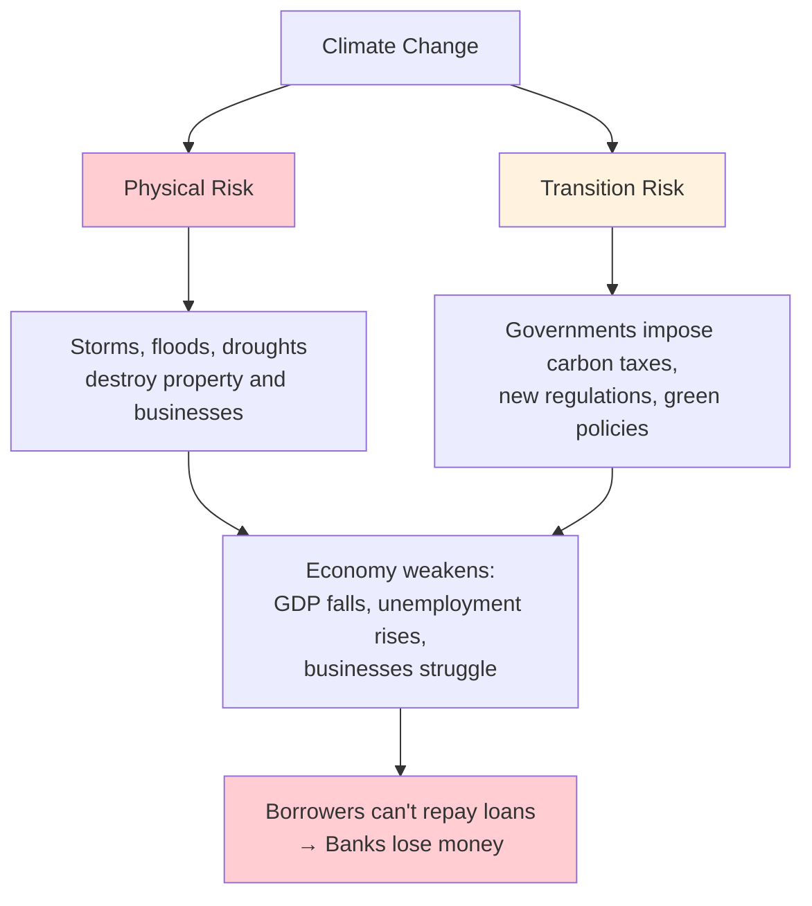
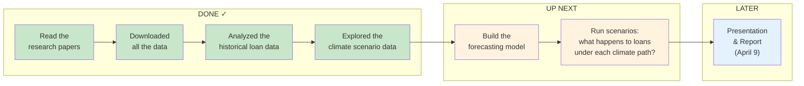
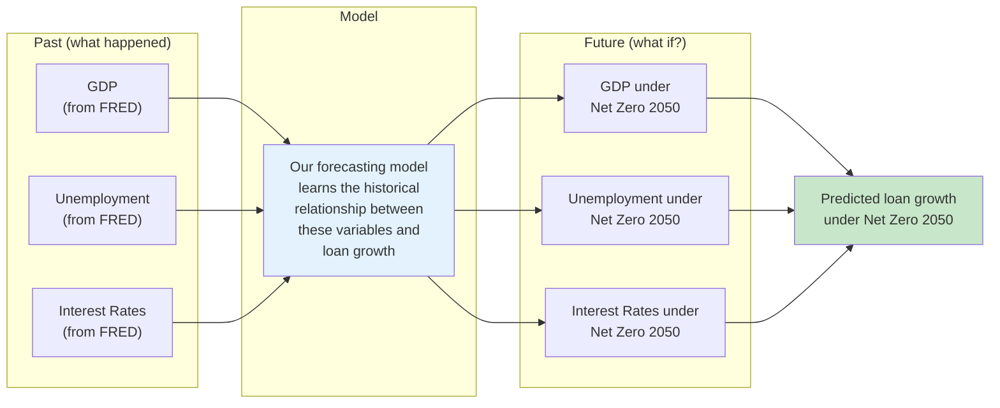
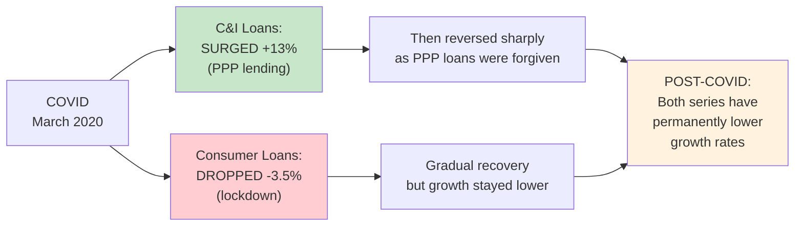
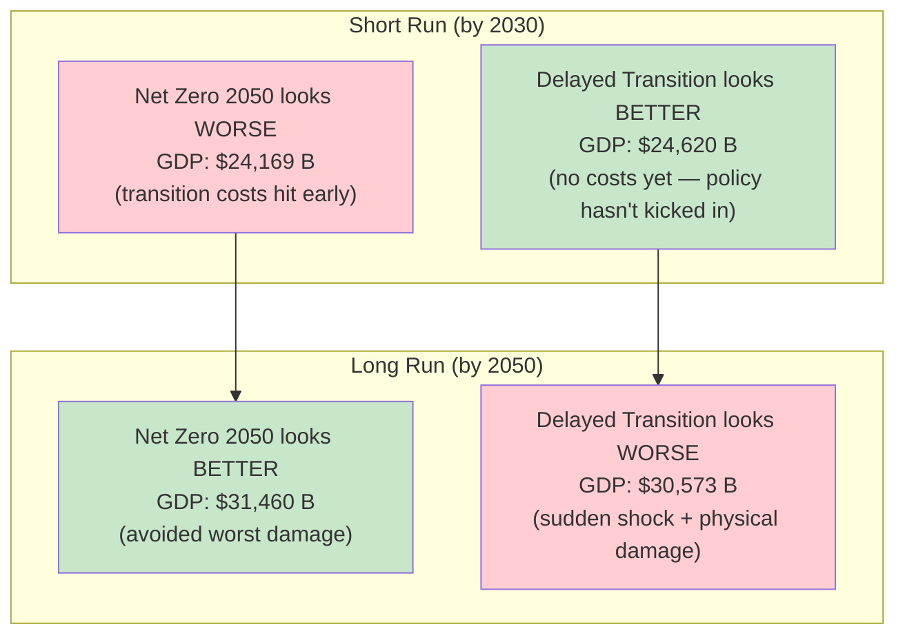
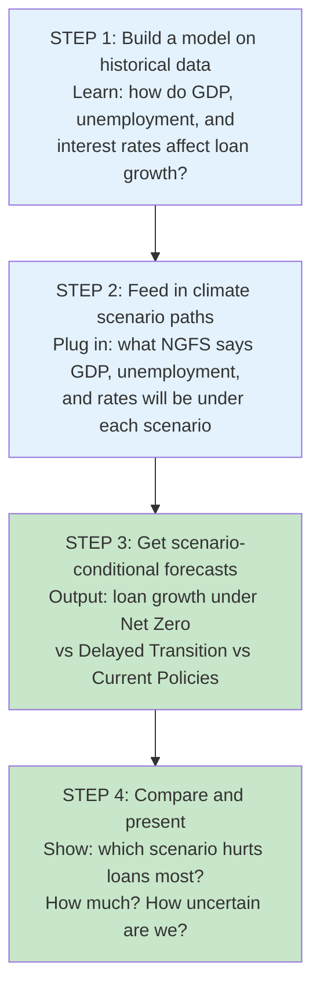

# Climate Risk & Loan Portfolios — Project Status

**Prepared for:** Feb 20, 2026 Q&A with Bank of America
**Last updated:** Feb 17, 2026

---

## The Big Picture: What Are We Actually Doing?

Bank of America wants to understand: **if climate change gets worse (or if governments react to it with new policies), what happens to the loans that banks hold?**

Banks hold two main types of loans:
- **C&I loans (Commercial & Industrial)** — loans to businesses. Think: a factory borrowing money to expand, a restaurant getting a line of credit.
- **Consumer loans** — loans to regular people. Think: car loans, credit cards, personal loans.

Climate change can hurt these loans in two ways:

**Physical risk** = the actual damage from climate change (hurricanes, floods, heat waves).
**Transition risk** = the economic disruption from *reacting* to climate change (carbon taxes, regulations, industries shutting down).

The irony: if governments act aggressively NOW (transition risk goes up), they prevent the worst physical damage LATER. If they do nothing, physical risk gets much worse long-term.

Our job is to **build a forecasting model** that shows how different climate policy choices lead to different outcomes for bank loan portfolios.

---

## Where Are We in the Project?

**Timeline:**
- **Feb 12:** Kickoff with BofA (done)
- **Feb 20 (Thursday):** First Q&A session — this is what we're prepping for
- **April 9:** Final 30-minute presentation at Emory

---

## What We Learned from the Research Papers

We read two major Federal Reserve research papers and extracted 401 specific facts. Here are the most important takeaways:

### The Numbers That Matter

| What | Number | What It Means |
|------|--------|---------------|
| **GDP damage from doing nothing** | -5.66% of world GDP | If we keep current policies, the economy shrinks significantly from physical climate damage alone |
| **GDP damage with orderly transition** | -1.97% of world GDP | Acting early costs less in the long run |
| **Worst-case bank loan losses** | Up to 14% of C&I loan portfolio | Even in the most extreme scenario, banks don't lose everything — it's bounded |
| **Typical bank exposure** | 0.5% to 6.4% of C&I portfolio | Most scenarios produce modest but real losses |
| **Top 4 US banks capital shortfall** | $425 billion | Under an extreme "stranded assets" scenario (think: oil companies' assets become worthless) |

### One Critical Problem

The research papers can only estimate the impact on **business loans (C&I)**. For **consumer loans**, the models don't work because they track industries, not individual households. So we need a different approach for consumer loans — we'll use the indirect route through unemployment, interest rates, and inflation (things that affect whether regular people can repay their loans).

---

## What Data Do We Have?

### Historical U.S. Data (from FRED — the Federal Reserve's database)

We downloaded 7 economic time series. Think of each one as a long spreadsheet of monthly numbers going back decades:

| Data Series | What It Is | Why We Need It | How Far Back |
|-------------|-----------|----------------|-------------|
| **BUSLOANS** | Total C&I loans at US banks ($ billions) | This is our main thing to forecast | 1947 – 2025 |
| **CONSUMER** | Total consumer loans ($ billions) | Second thing to forecast | 1947 – 2025 |
| **GDPC1** | US GDP (how big the economy is) | Climate scenarios affect GDP first | 1947 – 2025 |
| **UNRATE** | Unemployment rate | When people lose jobs, they can't repay loans | 1948 – 2026 |
| **FEDFUNDS** | The interest rate the Fed sets | Higher rates = harder to borrow = less lending | 1954 – 2026 |
| **DGS10** | 10-year Treasury bond yield | Reflects long-term borrowing costs | 1962 – 2026 |
| **CPIAUCSL** | Consumer Price Index (inflation) | Inflation erodes loan values and changes Fed policy | 1947 – 2026 |

### Climate Scenario Data (from the NGFS)

The **NGFS** (Network for Greening the Financial System) is a group of 121 central banks that created standardized climate scenarios. Think of them as "what if" stories about the future:

| Scenario | The Story | What Happens |
|----------|----------|-------------|
| **Net Zero 2050** | Governments act now, aggressively | Carbon taxes start high and grow. Short-term economic pain, but long-term stability |
| **Below 2°C** | Governments act now, moderately | Similar to Net Zero but less extreme |
| **Delayed Transition** | Governments do nothing until 2030, then panic | No costs until 2030, then sudden, sharp policy shock |
| **Fragmented World** | Some countries act, others don't | Uncoordinated, messy, worst of both worlds |
| **NDCs** | Countries keep their current Paris Agreement promises (but no more) | Moderate transition, but insufficient to prevent physical damage |
| **Current Policies** | Nobody does anything new | Temperatures exceed 3°C — worst physical damage |

We downloaded two big Excel files:
- **IAM data** (63 MB): Carbon prices, CO2 emissions, energy data out to 2100
- **NiGEM data** (27 MB): Economic projections (GDP, unemployment, interest rates, inflation, stock prices, house prices) out to 2050

**Why NiGEM matters so much:** It gives us the **same economic variables** (GDP, unemployment, interest rates) that we have historical data for — but projected into the future under each climate scenario. This is the bridge that connects climate scenarios to our loan forecasting model.

**The logic:** If we know historically that "when unemployment goes up by 1%, loan growth drops by X%," and the climate scenarios tell us unemployment will be 4.5% by 2030, we can predict what happens to loans.

---

## What Our Analysis Found

### Finding 1: Loan levels trend upward — we need to transform the data

Loan balances ($2,700 billion for C&I, $1,858 billion for consumer) trend upward over time. You can't forecast a series that just keeps going up — it has no stable average to anchor predictions to.

**Solution:** We converted everything to **monthly growth rates** using the formula the professor uses in class: $100 \times \ln(Y_t / Y_{t-1})$. This measures "what percent did loans grow this month?" Growth rates bounce around a stable average, which makes them forecastable.

**The formal test:** We ran two statistical tests (ADF and KPSS) that check whether a series has a stable average:
- Loan levels: **NOT stable** (confirmed by both tests)
- Loan growth rates: **Stable** (confirmed by ADF)

**What this means:** All of our modeling will use growth rates, not dollar levels.

### Finding 2: COVID was a massive, asymmetric shock

This is the most striking thing in the data, and it's directly relevant to what BofA asked about.

**C&I loans SURGED during COVID** (because of PPP — the government's Paycheck Protection Program that pumped loans through banks):
- April 2020: C&I loan growth spiked to **+13.0% in a single month**
- That's **13.9 standard deviations** from normal — a once-in-forever event
- 8 months during COVID exceeded 3 standard deviations

**Consumer loans DROPPED** (because people stopped spending during lockdowns):
- April 2020: Consumer loans fell **-3.5%**
- That's 3.5 standard deviations — extreme, but nothing like the C&I spike
- Only 1 month exceeded 3 standard deviations

**Why this matters for BofA:**
1. COVID shows that loan portfolios are **highly sensitive to abrupt shocks** — exactly the kind of shock a sudden climate policy could cause
2. The response was **asymmetric** — C&I and consumer loans reacted in opposite directions. This means we should model them separately.
3. Post-COVID, both loan series have **materially lower growth rates** (C&I: 0.17%/month vs 0.61% pre-COVID; Consumer: 0.32% vs 0.68%). This means the recent economy is different from the pre-COVID economy.
4. **We need to decide what to do about COVID in our model.** This is a key question for Thursday's Q&A.

### Finding 3: We built baseline forecasting models

We used the method from class (AR models — autoregressive models that predict next month's growth using past months' growth) to establish a baseline. Think of this as the "dumb" model that just uses the loan series' own history.

**What an AR model is, simply:** "Last month's loan growth, and the months before that, help predict this month's loan growth." AR(4) means "use the last 4 months." AR(12) means "use the last 12 months."

**What we found:**

| Loan Type | Best Model | What It Means |
|-----------|-----------|---------------|
| **C&I loans** | AR(12) — uses 12 months of history | There's a seasonal pattern in commercial lending (makes sense: businesses follow annual budget cycles) |
| **Consumer loans** | AR(4) — uses 4 months of history | Simpler pattern, no strong seasonality |

**Quality check:** We ran the Ljung-Box test (checks if there's any predictable pattern left in the errors). Both models passed — meaning they captured all the predictable structure in the data.

**Why this matters:** Any fancier model we build (one that includes unemployment, interest rates, etc.) must beat these baselines. If adding macro variables doesn't improve the forecast, there's no point in using them.

### Finding 4: Which economic variables predict loan growth?

We checked which macro variables are correlated with loan growth (using data from 1990 onward):

- **Unemployment changes** — significantly correlated with both C&I and consumer loan growth. When unemployment rises, loan growth falls. This is intuitive: businesses and people borrow less when the economy is bad.
- **Fed Funds rate changes** — also correlated. When the Fed raises rates, borrowing becomes more expensive and loan growth slows.
- **Inflation (CPI growth)** — some correlation, weaker than the other two.

**What this means for our model:** Unemployment and interest rates should definitely be in our forecasting model. Inflation is a maybe.

---

## What the Climate Scenario Data Shows

### Key Numbers: How Different Scenarios Affect the US Economy

These are from the NiGEM model (GCAM variant) for the United States:

**GDP by 2050 (in billions of 2017 dollars):**

| Scenario | GDP in 2050 | Compared to Best |
|----------|------------|-----------------|
| Net Zero 2050 (act now) | $31,460 B | **Highest** |
| Below 2°C | $31,209 B | -$251 B |
| Delayed Transition (wait then panic) | $30,573 B | -$887 B |
| NDCs (current promises) | $30,374 B | -$1,086 B |
| Fragmented World | $30,300 B | **Lowest** (-$1,160 B) |

**What this shows:** Acting early (Net Zero 2050) actually produces the **highest GDP by 2050** because it avoids the worst physical damage. Doing nothing or acting late produces lower GDP. The difference is over $1 trillion.

**Unemployment by 2040:**

| Scenario | Unemployment |
|----------|-------------|
| Net Zero 2050 | 4.56% |
| Delayed Transition | **4.69%** (highest) |
| Below 2°C | 4.53% |

**The pattern is the same:** Delayed action leads to worse unemployment because the sudden policy shock in 2030 disrupts the economy more than gradual action starting now.

### The Big Insight About Scenarios

**In plain English:** If you act early, you pay a short-term cost but end up better off. If you wait, things look fine for a while, but then you get hit with both the policy shock AND the physical damage. This is the central finding across every central bank exercise worldwide.

### One Complication: Different Models Give Different Answers

The climate scenarios are produced by 3 different scientific models (GCAM, REMIND, MESSAGEix). They give somewhat different numbers for the same scenario — the spread is about 3% across models for the same variable. This is **model uncertainty** and we should present it honestly (BofA specifically said they value transparency over fake precision).

---

## Our Modeling Plan (What We'll Do Next)

**Model types we'll try:**
- **AR (autoregressive):** Predict loans using only past loan values. This is our baseline to beat.
- **VAR (vector autoregression):** Predict loans AND macro variables together as a system. Loan growth, unemployment, and interest rates all affect each other.
- **ADL (autoregressive distributed lag):** Predict loans using past loans PLUS past values of macro variables.

### Decisions We Still Need to Make

These are the things we want BofA's input on:

| Decision | The Question | Our Best Guess |
|----------|-------------|----------------|
| **COVID treatment** | Do we drop the COVID months from our data, or include them with special adjustments? | Drop them (cleanest approach) |
| **How far back?** | Use data from 1947? 1990? 2000? More history = more business cycles but banking has changed a lot. | Start from 1990 |
| **Frequency** | Climate data is annual, loan data is monthly. Do we make everything annual, or stretch the climate data to monthly? | Make everything annual (simpler, fewer assumptions) |
| **How far to forecast?** | To 2030? 2040? 2050? | To 2050 (matches the scenarios) |
| **Which scenarios?** | All 7? Or focus on 3 representative ones? | Focus on Net Zero, Delayed Transition, and NDCs |

---

## Questions for Thursday's Q&A (Feb 20)

### The 5 Most Important Questions

**1. "How should we handle COVID in our model?"**

We found that COVID caused a +13% spike in C&I loans (from PPP) and a -3.5% drop in consumer loans — in opposite directions. After COVID, both series have much lower growth rates. Should we:
- Drop the COVID months entirely?
- Add special COVID variables to the model?
- Treat post-COVID as a "new normal" with a different baseline?

*Why we're asking:* BofA said in the kickoff that COVID treatment is something they regularly discuss with modelers. We want to match their preferred approach.

**2. "Is starting our data from 1990 far enough back?"**

We have data going back to 1947, but banking has changed dramatically. Post-1990 covers 3 recessions, the 2008 financial crisis, and COVID. Is that enough business cycle variation, or should we go further back?

*Why we're asking:* BofA emphasized that the training window should cover enough business cycles.

**3. "Should we aggregate to annual or interpolate to monthly?"**

The climate scenario data is annual (one number per year). Our loan data is monthly. We can either:
- Collapse our monthly data to annual averages (simpler, but we lose month-to-month detail)
- Stretch the annual climate data to monthly (keeps detail, but we're making up the within-year pattern)

*Why we're asking:* This is a big methodological choice that affects everything downstream.

**4. "How should we approach consumer loans?"**

The Fed research papers explicitly say their models can't estimate consumer loan exposure — the models track industries, not households. We plan to use an indirect approach: climate scenarios affect unemployment and interest rates, which affect whether consumers can repay. Does BofA have a different suggestion?

*Why we're asking:* Consumer loans are half the project, and we want to make sure our approach is defensible.

**5. "What forecast horizon matters most to you?"**

The scenario divergence is small before 2030 and large after 2040. Should we present 2030/2040/2050 results? Is there a specific time horizon that matters most for BofA Treasury's planning?

### Backup Questions (If Time Allows)

**6.** Which climate scenarios are you most interested in? We're planning to focus on Net Zero 2050, Delayed Transition, and NDCs.

**7.** Should we prioritize showing that our model improves on simple baselines, or focus on the scenario comparison even if the improvement is modest?

**8.** The data lets us decompose impacts into "transition risk" vs "physical risk" — is that level of detail useful for your purposes, or too granular?

**9.** Are there internal BofA benchmarks we should try to compare against?

**10.** For the April presentation, should we lead with the methodology or the headline results?

---

## Everything We've Built So Far

### Files and Notebooks

| What | Where | What It Contains |
|------|-------|-----------------|
| Research factbase | `facts/by-source/` (9 files) | 401 extracted facts from papers, transcript, lectures |
| Analysis report | `analysis/latest.md` | Comprehensive research synthesis |
| Empirical analysis | `empirical_analysis.ipynb` | All the historical loan data analysis |
| NGFS exploration | `ngfs_exploration.ipynb` | Climate scenario data exploration |
| Figures | `outputs/figures/` (12 plots) | All saved at print quality (300 DPI) |

### Key Figures We Can Show

| Figure | What It Shows | Why It's Useful |
|--------|-------------|----------------|
| Levels overview | All 7 data series over time with COVID highlighted | Sets the stage: "here's what we're working with" |
| Growth rates | Monthly loan growth with COVID annotated | Shows the COVID spike dramatically |
| COVID zoom | Bar chart of 2019-2022 growth rates | Makes the asymmetry between C&I and consumer obvious |
| ACF/PACF | Autocorrelation patterns | Justifies our AR model choices (technical audience) |
| BIC selection | Model selection curves | Shows how we chose AR order (technical audience) |
| Cross-correlations | Loan growth vs macro variables at different lags | Justifies including unemployment and rates in the model |
| Scenario paths | GDP, unemployment, rates under each climate scenario | The core "what if" visualization |
| Scenario diffs | How much each scenario deviates from baseline | Shows which scenarios hurt most |
| Risk decomposition | Transition vs physical risk on GDP | Answers "where does the damage come from?" |
| Model uncertainty | Same scenario, 3 different models | Shows honest uncertainty |

---

## The Story We'll Tell BofA (Preview)

If we had to give the presentation today, the headline would be:

> **Acting early on climate policy costs less in the long run. Delayed action looks cheaper now but produces worse outcomes by 2040-2050 — both for the economy and for bank loan portfolios.**

The supporting points:
1. **COVID proved that loan portfolios are vulnerable to sudden shocks** — C&I loans swung 13% in a single month. A disorderly climate transition would be a slower but sustained version of this.
2. **C&I and consumer loans respond differently** — they need separate models and separate stories.
3. **The scenario spread is meaningful but bounded** — even worst-case, bank exposure tops out around 14% of C&I portfolios. Climate risk is real but not existential for the banking system.
4. **Model uncertainty is substantial** — honest about what we don't know. Three different scientific models give different answers for the same scenario.
5. **Post-COVID, we're in a different lending environment** — growth rates are structurally lower. The training window and COVID treatment decisions matter.
